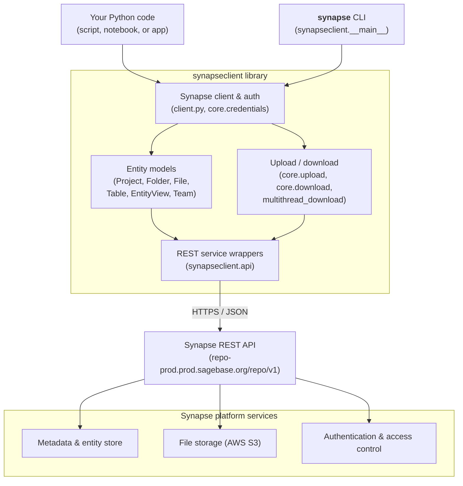

Synapse Python Client
=====================

Branch  | Build Status
--------|---------------------------------------------------------------------------------------------------------------------------------------------------------------------------------------------------------------------------
develop | [](https://github.com/Sage-Bionetworks/synapsePythonClient/actions?query=branch%3Adevelop)
master  | [](https://github.com/Sage-Bionetworks/synapsePythonClient/actions?query=branch%3Amaster)

[](https://pypi.python.org/pypi/synapseclient/) [](https://pypi.python.org/pypi/synapseclient/)

This is a Python client for [Synapse](https://www.synapse.org/), built by [Sage Bionetworks](https://sagebionetworks.org/). Synapse is an open-source platform for research teams. Teams use it to share data, track analyses, and work together. You can use this client in two ways. You can call it as a library in your own code, or run it as a command-line tool.

There is also a [Synapse client for R](https://github.com/Sage-Bionetworks/synapser/).

Documentation
-------------

For more information about the Python client, see:

 * [Python client API docs](https://python-docs.synapse.org)

For more information about interacting with Synapse, see:

 * [Synapse API docs](https://rest-docs.synapse.org/rest/)
 * [Use cases](https://help.synapse.org/docs/Use-Cases.1985151645.html)
 * [Getting Started Guide to Synapse](https://help.synapse.org/docs/Getting-Started.2055471150.html)

For release information, see:

 * [Release notes](https://python-docs.synapse.org/news/)

<!-- Subscribe to release and other announcements [here](https://groups.google.com/a/sagebase.org/forum/#!forum/python-announce)
or by sending an email to [python-announce+subscribe@sagebase.org](mailto:python-announce+subscribe@sagebase.org) -->


## Architecture

This Python code may be used either as a library or through the `synapse`
command-line interface. The client handles authentication, models Synapse entities
(Projects, Folders, Files, Tables, and more), and manages file upload/download. It
issues requests to the [Synapse REST API](https://rest-docs.synapse.org/rest/), which
is backed by the Synapse platform services (metadata storage, file storage on AWS S3,
access control, and provenance).




Installation
------------

We test the client on Python 3.10, 3.11, 3.12, 3.13, and 3.14. It runs on Mac OS X, Linux, and Windows.

**Version 3.0 and later needs Python 3.10 or higher.**

### Install using pip

The [Python Synapse Client is on PyPI](https://pypi.python.org/pypi/synapseclient) and can be installed with pip:

    # Here are a few ways to install the client. Choose the one that fits your use-case
    # sudo may optionally be needed depending on your setup

    pip install --upgrade synapseclient
    pip install --upgrade "synapseclient[pandas]"
    pip install --upgrade "synapseclient[pandas, pysftp, boto3]"

...or to upgrade an existing installation of the Synapse client:

    # sudo may optionally be needed depending on your setup
    pip install --upgrade synapseclient

The `pandas`, `pysftp`, and `boto3` packages are optional. Synapse
[Tables](https://python-docs.synapse.org/reference/tables/) work
with [Pandas](http://pandas.pydata.org/). You need `pysftp` only for
[SFTP](https://python-docs.synapse.org/guides/data_storage/#sftp) file storage. Each of
these packages includes native code. You may need to build it, or install a prebuilt
version.

### Install from source

Clone the [source code repository](https://github.com/Sage-Bionetworks/synapsePythonClient).

    git clone git://github.com/Sage-Bionetworks/synapsePythonClient.git
    cd synapsePythonClient
    pip install .

Alternatively, you can use pip to install a particular branch, commit, or other git reference:

    pip install git+https://github.com/Sage-Bionetworks/synapsePythonClient@master

or

    pip install git+https://github.com/Sage-Bionetworks/synapsePythonClient@my-commit-hash

Command line usage
------------------

You can run the client from the shell. Commands include: query, get, cat, add,
update, delete, and onweb. Here are a few examples.

### downloading test data from Synapse

    synapse -p auth_token get syn1528299

### getting help

    synapse -h

Note that a [Synapse account](https://www.synapse.org/#RegisterAccount:0) is required.


Usage as a library
------------------

You can use the client to write software that works with Synapse. For more examples, see the [Tutorials](https://python-docs.synapse.org/tutorials/home/).

### Examples

#### Log-in and create a Synapse object
```
import synapseclient

syn = synapseclient.Synapse()
## You may optionally specify the debug flag to True to print out debug level messages.
## A debug level may help point to issues in your own code, or uncover a bug within ours.
# syn = synapseclient.Synapse(debug=True)

## log in using auth token
syn.login(authToken='auth_token')
```

#### Sync a local directory to synapse
This is the best way to sync more than one file or folder to a Synapse project. It uses `synapseutils`. The library schedules all the work needed to sync a whole directory tree. To learn about the manifest file format, see [`synapseutils.syncToSynapse`](https://python-docs.synapse.org/reference/synapse_utils/#synapseutils.sync.syncToSynapse).
```
import synapseclient
import synapseutils
import os

syn = synapseclient.Synapse()

## log in using auth token
syn.login(authToken='auth_token')

path = os.path.expanduser("~/synapse_project")
manifest_path = f"{path}/my_project_manifest.tsv"
project_id = "syn1234"

# Create the manifest file on disk
with open(manifest_path, "w", encoding="utf-8") as f:
    pass

# Walk the specified directory tree and create a TSV manifest file
synapseutils.generate_sync_manifest(
    syn,
    directory_path=path,
    parent_id=project_id,
    manifest_path=manifest_path,
)

# Using the generated manifest file, sync the files to Synapse
synapseutils.syncToSynapse(
    syn,
    manifestFile=manifest_path,
    sendMessages=False,
)
```

#### Store a Project to Synapse
```
import synapseclient
from synapseclient.models import Project

syn = synapseclient.Synapse()

## log in using auth token
syn.login(authToken='auth_token')

project = Project('My uniquely named project')
project.store()

print(project.id)
print(project)
```

#### Store a Folder to Synapse (Does not upload files within the folder)
```
import synapseclient
from synapseclient.models import Folder

syn = synapseclient.Synapse()

## log in using auth token
syn.login(authToken='auth_token')

folder = Folder(name='my_folder', parent_id="syn123")
folder.store()

print(folder.id)
print(folder)

```

#### Store a File to Synapse
```
import synapseclient
from synapseclient.models import File

syn = synapseclient.Synapse()

## log in using auth token
syn.login(authToken='auth_token')

file = File(
    path="path/to/file.txt",
    parent_id="syn123",
)
file.store()

print(file.id)
print(file)
```

#### Get a data matrix
```
import synapseclient
from synapseclient.models import File

syn = synapseclient.Synapse()

## log in using auth token
syn.login(authToken='auth_token')

## retrieve a 100 by 4 matrix
matrix = File(id='syn1901033').get()

## inspect its properties
print(matrix.name)
print(matrix.description)
print(matrix.path)

## load the data matrix into a dictionary with an entry for each column
with open(matrix.path, 'r') as f:
    labels = f.readline().strip().split('\t')
    data = {label: [] for label in labels}
    for line in f:
        values = [float(x) for x in line.strip().split('\t')]
        for i in range(len(labels)):
            data[labels[i]].append(values[i])

## load the data matrix into a numpy array
import numpy as np
np.loadtxt(fname=matrix.path, skiprows=1)
```


Authentication
--------------
You log in to [Synapse](https://www.synapse.org/#RegisterAccount:0) with a personal access token. Learn more about [personal access tokens](https://help.synapse.org/docs/Managing-Your-Account.2055405596.html#ManagingYourAccount-PersonalAccessTokens).

You can also log in in [other ways](https://python-docs.synapse.org/tutorials/authentication/).


Synapse Utilities (synapseutils)
--------------------------------

`synapseutils` holds handy helper functions. You can use them to walk through large projects, copy entities, download files, and more.

### Example

    import synapseutils
    import synapseclient
    syn = synapseclient.login()

    # copies all Synapse entities to a destination location
    synapseutils.copy(syn, "syn1234", destinationId = "syn2345")

    # copies the wiki from the entity to a destination entity. Only a project can have sub wiki pages.
    synapseutils.copyWiki(syn, "syn1234", destinationId = "syn2345")


    # Traverses through Synapse directories, behaves exactly like os.walk()
    walkedPath = synapseutils.walk(syn, "syn1234")

    for dirpath, dirname, filename in walkedPath:
        print(dirpath)
        print(dirname)
        print(filename)

OpenTelemetry (OTEL)
--------------------------------
[OpenTelemetry](https://opentelemetry.io/) collects traces and spans. These show you latency, errors, and other performance data. The client can send traces when you want them. It supports OTLP exports, which you set up with environment variables (see [the spec](https://opentelemetry.io/docs/specs/otel/protocol/exporter/)).

Read more about [OpenTelemetry in Python](https://opentelemetry.io/docs/instrumentation/python/).


### Exporting Synapse Client Traces to Jaeger for developers
Here is an example. It sets up [Jaeger](https://www.jaegertracing.io/docs/1.50/deployment/#all-in-one) with Docker, then runs a short Python script that uses the client.

#### Running the jaeger docker container
Start a docker container with the following options:
```
docker run --name jaeger \
  -e COLLECTOR_OTLP_ENABLED=true \
  -p 16686:16686 \
  -p 4318:4318 \
  jaegertracing/all-in-one:latest
```
Explanation of ports:
* `4318` HTTP port for OTLP data collection
* `16686` Jaeger UI for visualizing traces

When the container is running, open the Jaeger UI at `http://localhost:16686`.

#### Environment Variable Configuration

By default, the exporter sends trace data to `http://localhost:4318/v1/traces`. You can change this with environment variables:

* `OTEL_SERVICE_NAME`: A name for your app in the trace data (defaults to 'synapseclient'). Pick a clear name. It makes traces easier to find and sort.
* `OTEL_EXPORTER_OTLP_ENDPOINT`: The URL where trace data is sent (defaults to 'http://localhost:4318'). Point it at your own collector or monitoring service.
* `OTEL_DEBUG_CONSOLE`: Set this to 'true' to print traces to the console. This helps when you test or debug without a collector.
* `OTEL_SERVICE_INSTANCE_ID`: Tells apart copies of the same service (for example 'prod', 'development', or 'local'). It shows which one created each trace.
* `OTEL_EXPORTER_OTLP_HEADERS`: Adds auth and metadata to exports. Use it to send API keys or tokens to secured collectors or other services.


#### Enabling OpenTelemetry in your code
To turn on OpenTelemetry, call `enable_open_telemetry()` on the `Synapse` class. You can
also get the tracer with `get_tracer()`. Use the tracer to create new spans in your code.

```python
import synapseclient

# Enable OpenTelemetry with default settings
synapseclient.Synapse.enable_open_telemetry()
tracer = synapseclient.Synapse.get_tracer()

# Then create and use the Synapse client as usual
with tracer.start_as_current_span("my_function_span"):
    syn = synapseclient.Synapse()
    syn.login(authToken='auth_token')
```

### Exporting Synapse Client Traces to SigNoz Cloud for developers

#### Prerequisites
1. Create an account on SigNoz Cloud.
2. Create an ingestion key. Follow the steps [here](https://signoz.io/docs/ingestion/signoz-cloud/keys/).

#### Environment Variable Configuration
The following environment variables are required to be set:
- `OTEL_EXPORTER_OTLP_HEADERS`: `signoz-ingestion-key=<key>`
- `OTEL_EXPORTER_OTLP_ENDPOINT`: `https://ingest.us.signoz.cloud`
- `OTEL_SERVICE_NAME`: `your-service-name`

Explanation of both required and optional environment variables:
##### Required
* `OTEL_EXPORTER_OTLP_ENDPOINT`: The OTLP endpoint where traces are sent.
* `OTEL_EXPORTER_OTLP_HEADERS`: Auth and metadata for exports, such as API keys or tokens. For SigNoz, use `signoz-ingestion-key=<key>`.

##### Optional
* `OTEL_SERVICE_NAME`: A name for your app in the trace data (defaults to synapseclient). Pick a clear name so you can sort traces by service.
* `OTEL_DEBUG_CONSOLE`: Set this to 'true' to print traces to the console. This helps when you test or debug without a collector.
* `OTEL_SERVICE_INSTANCE_ID`: Tells apart copies of the same service (for example 'prod', 'development', or 'local'). It shows which one created each trace.

#### Enabling OpenTelemetry in your code
To turn on OpenTelemetry, call `enable_open_telemetry()` on the `Synapse` class. You can
also get the tracer with `get_tracer()`. Use the tracer to create new spans in your code.

```python
import synapseclient
from dotenv import load_dotenv

# Set environment variables
os.environ["OTEL_EXPORTER_OTLP_ENDPOINT"] = "https://ingest.us.signoz.cloud"
os.environ["OTEL_EXPORTER_OTLP_HEADERS"] = "signoz-ingestion-key=<your key>"
os.environ["OTEL_SERVICE_NAME"] = "your-service-name"
os.environ["OTEL_SERVICE_INSTANCE_ID"] = "local"

# Enable OpenTelemetry with default settings
synapseclient.Synapse.enable_open_telemetry()
tracer = synapseclient.Synapse.get_tracer()

# Then create and use the Synapse client as usual
with tracer.start_as_current_span("my_function_span"):
    syn = synapseclient.Synapse()
    syn.login(authToken='auth_token')
```

#### Advanced Configuration

You can pass additional resource attributes to `enable_open_telemetry()`:

```python
import synapseclient

# Enable with custom resource attributes
synapseclient.Synapse.enable_open_telemetry(
    resource_attributes={
        "deployment.environment": "development",
        "service.version": "1.2.3", # Overrides the `OTEL_SERVICE_NAME` environment variable
        "service.instance.id": "4.5.6",  # Overrides the `OTEL_SERVICE_INSTANCE_ID` environment variable
        "custom.attribute": "value"
    }
)
```

When you turn on OpenTelemetry, the client does the following for you:

1. It sets up instrumentation for:
   - **Threading** (via `ThreadingInstrumentor`): Passes trace context across threads. This keeps traces intact in multi-threaded code.
   - **HTTP libraries**:
     - `requests` (via `RequestsInstrumentor`): Captures every HTTP request, with its method, URL, status code, and timing.
     - `httpx` (via `HTTPXClientInstrumentor`): Tracks both sync and async HTTP requests.
     - `urllib` (via `URLLibInstrumentor`): Watches low-level HTTP calls from the standard library.
   - Each HTTP library also pulls Synapse entity IDs from URLs when it can. It adds them as span attributes.

2. It collects spans across your app:
   - Each span records how long a step takes, plus its status and any errors.
   - Some attributes (like `synapse.transfer.direction` and `synapse.operation.category`) pass down to child spans for uploads and downloads.
   - Trace data is exported via OTLP (OpenTelemetry Protocol).

3. It adds resource details to your traces, including:
   - Python version
   - OS type
   - Synapse client version
   - Service name (defaults to "synapseclient"; you can change it with environment variables)
   - Service instance ID

Once you turn on OpenTelemetry, you cannot turn it off in the same process. To disable it, restart your Python interpreter.


License and Copyright
---------------------

&copy; Copyright 2013-25 Sage Bionetworks

This software is licensed under the [Apache License, Version 2.0](http://www.apache.org/licenses/LICENSE-2.0).
