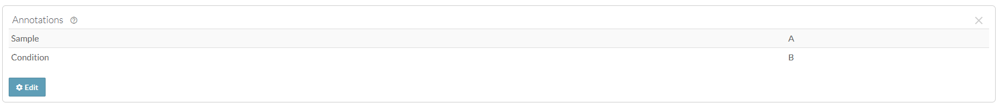

# Domain Model of Synapse
Here you'll find more information about how all of the models/concepts of Synapse
work together and what their purpose is.

## Entity
Any distinct item in Synapse that has its own Synapse ID, including a project, folder, file, wiki, dataset, and view, among other items.

Synapse entities are identified by a unique identifier called a Synapse ID, or synID. The synID is represented by the prefix “syn” followed by numbers (for example, syn12345678). This identifier can be used to refer to a specific entity on the web and through the programmatic clients.

## [Projects](../tutorials/python/project.md)
Projects in Synapse are “containers” that group relevant content and people together. All data must be uploaded into a project. Projects can be private so only you can see the contents, they can be shared with your collaborators, or they can be made public so anyone on the web can view your research.

Projects help you to:

* **Organize your work**: With Synapse, you can organize the parts in your workflow (data, code, etc) into a hierarchy like a file system. With the tabs across the top of each project, you can easily navigate to your wikis, files and folders, SQL-based tables, and even conduct conversations using discussion forums.

* **Store data, code, and results**: You can upload your data, code, and results to Synapse, or store a reference to their location in your local computer system or on the web. Everything can be stored as files hosted by Synapse, in your own external cloud storage, or using Docker containers.

* **Control data access or release it publicly**: You have complete control over how users and groups can interact with your work. Work privately, openly, or somewhere in between.

* **Link and share content with others**: Just as you can control the access to your work, projects can serve as a platform for linking and sharing your work with others.

* **Custom, searchable annotations**: Assign any key/value pair you want. Those values become searchable and available to those granted access.

* **Attach figures and documents**: Upload documents and images via the website or programmatically.

## [Folders](../tutorials/python/folder.md)
Similar to projects, folders are “containers” that offer an additional way to organize your data. Instead of uploading a bunch of single files into your project, you can create folders to separate your data in a systematic way.

Folders in Synapse always have a “parent”, which could be a project or a folder. You can organize collections of folders and sub-folders, just as you would on your local computer.

You can control who has access to folders that you upload in two ways. First, you can apply [sharing settings](https://help.synapse.org/docs/Sharing-Settings,-Permissions,-and-Conditions-for-Use.2024276030.html#SharingSettings,Permissions,andConditionsforUse-SharingSettings), which control who can view, edit, download, or delete a file. Second, you can also apply [conditions for use](https://help.synapse.org/docs/Sharing-Settings,-Permissions,-and-Conditions-for-Use.2024276030.html#SharingSettings,Permissions,andConditionsforUse-ConditionsforUse), which are additional requirements that Synapse users must meet before accessing your file. By default, files inherit the conditions for use of the Synapse folder where they are uploaded. You can also add additional conditions for use on specific folders within a folder.

- To read more about how to use sharing settings and conditions for use together, see the full article on [Sharing Settings, Permissions, and Conditions for Use](https://help.synapse.org/docs/Sharing-Settings,-Permissions,-and-Conditions-for-Use.2024276030.html).

## [Files](../tutorials/python/file.md)
Synapse files can be created by uploading content from your local computer or linking to digital files on the web. You can [annotate files with custom metadata](../tutorials/python/annotation.md), [embed files into Synapse wiki pages](https://help.synapse.org/docs/Links.2667774092.html), or [associate them with a DOI](https://help.synapse.org/docs/Digital-Object-Identifiers-(DOIs).1972405096.html).

Files in Synapse always have a “parent”, which could be a project or a folder. You can organize collections of files into folders and sub-folders, just as you would on your local computer.

You can control who has access to files that you upload in two ways. First, you can apply [sharing settings](https://help.synapse.org/docs/Sharing-Settings,-Permissions,-and-Conditions-for-Use.2024276030.html#SharingSettings,Permissions,andConditionsforUse-SharingSettings), which control who can view, edit, download, or delete a file. Second, you can also apply [conditions for use](https://help.synapse.org/docs/Sharing-Settings,-Permissions,-and-Conditions-for-Use.2024276030.html#SharingSettings,Permissions,andConditionsforUse-ConditionsforUse), which are additional requirements that Synapse users must meet before accessing your file. By default, files inherit the conditions for use of the Synapse folder where they are uploaded. You can also add additional conditions for use on specific files within a folder.

- To read more about how to use sharing settings and conditions for use together, see the full article on [Sharing Settings, Permissions, and Conditions for Use](https://help.synapse.org/docs/Sharing-Settings,-Permissions,-and-Conditions-for-Use.2024276030.html).

## [Annotations](../tutorials/python/annotation.md)
Annotations help users search for and find data, and they are a powerful tool used to systematically group and/or describe things in Synapse.

Annotations are stored as key-value pairs in Synapse, where the key defines a particular aspect of your data, for example (`species`, `assay`, `fileFormat`) and the value defines a variable that belongs to that category (`mouse`, `RNAseq`, `.bam`). You can use annotations to add additional information about a project, file, folder, table, or view. Annotations can be based on an existing ontology or controlled vocabulary, or can be created as needed and modified later as your metadata evolves.

For example, if you have uploaded a collection of alignment files in the BAM file format from an RNA-sequencing experiment, each representing a sample and experimental replicate, you can use annotations to surface this information in a structured way. Sometimes, users encode this information in file names, e.g., sampleA_conditionB.bam, which makes it “human-readable” but not searchable.

In this case, you may want to add annotations that look like this:

## [Activity/Provenance](../tutorials/python/activity.md)
Reproducible research is a fundamental responsibility of scientists, but the best practices for achieving it are not established in computational biology. The Synapse provenance system is one of many solutions you can use to make your work reproducible by you and others.

Provenance is a concept describing the origin of something. In Synapse, it is used to describe the connections between the workflow steps used to create a particular file or set of results. Data analysis often involves multiple steps to go from a raw data file to a finished analysis. Synapse’s provenance tools allow users to keep track of each step involved in an analysis and share those steps with other users.

The model Synapse uses for provenance is based on the [W3C provenance spec](https://www.w3.org/standards/techs/provenance#w3c_all) where items are derived from an activity which has components that were used and components that were executed. Think of the used items as input files and executed items as software or code. Both used and executed items can reside in Synapse or in URLs such as a link to a GitHub commit or a link to a specific version of a software tool.

**Activity** can be seen as an individual item, whereas **Provenance** can be seen as the relationship of multiple activities.
