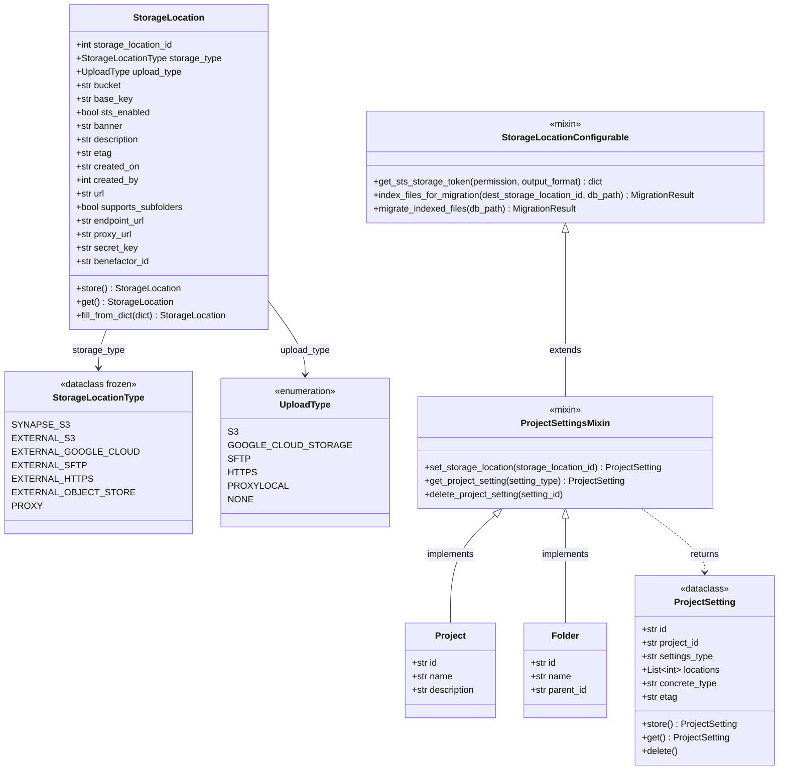
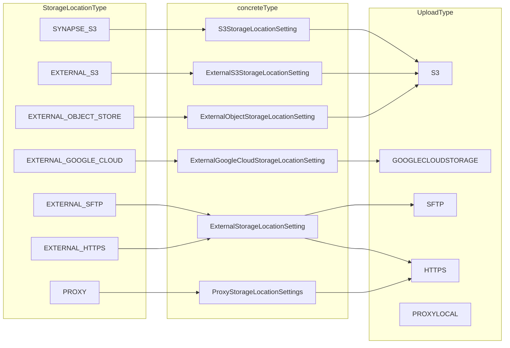
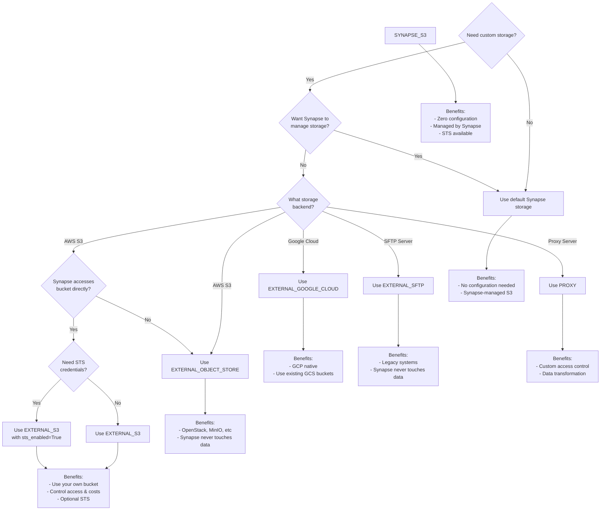
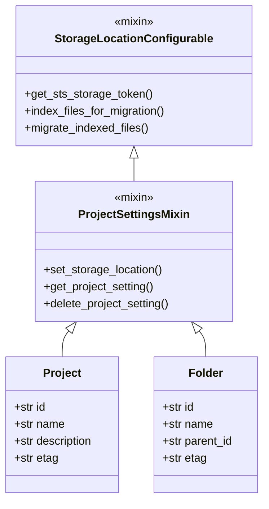
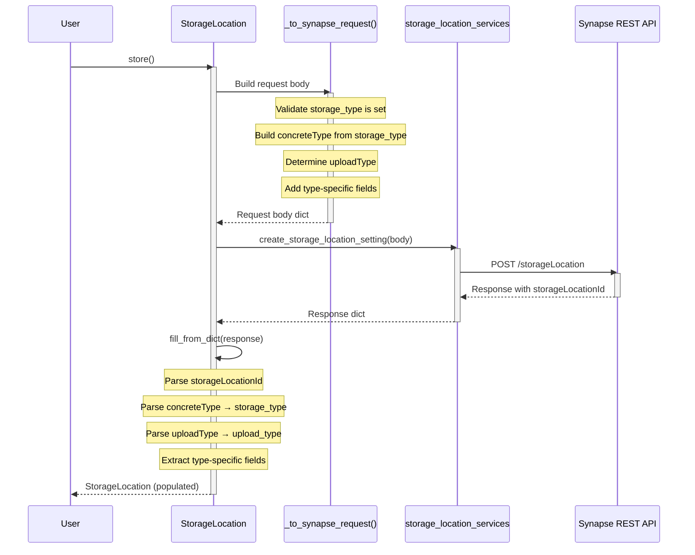
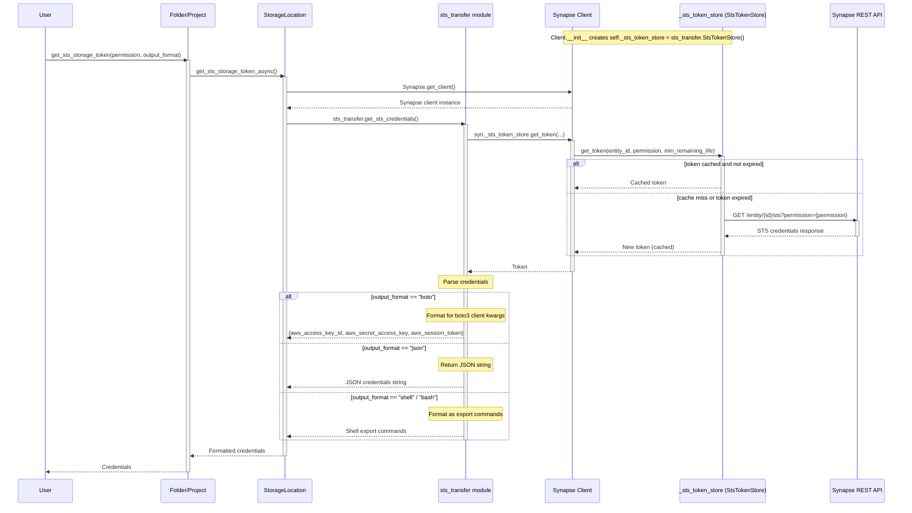
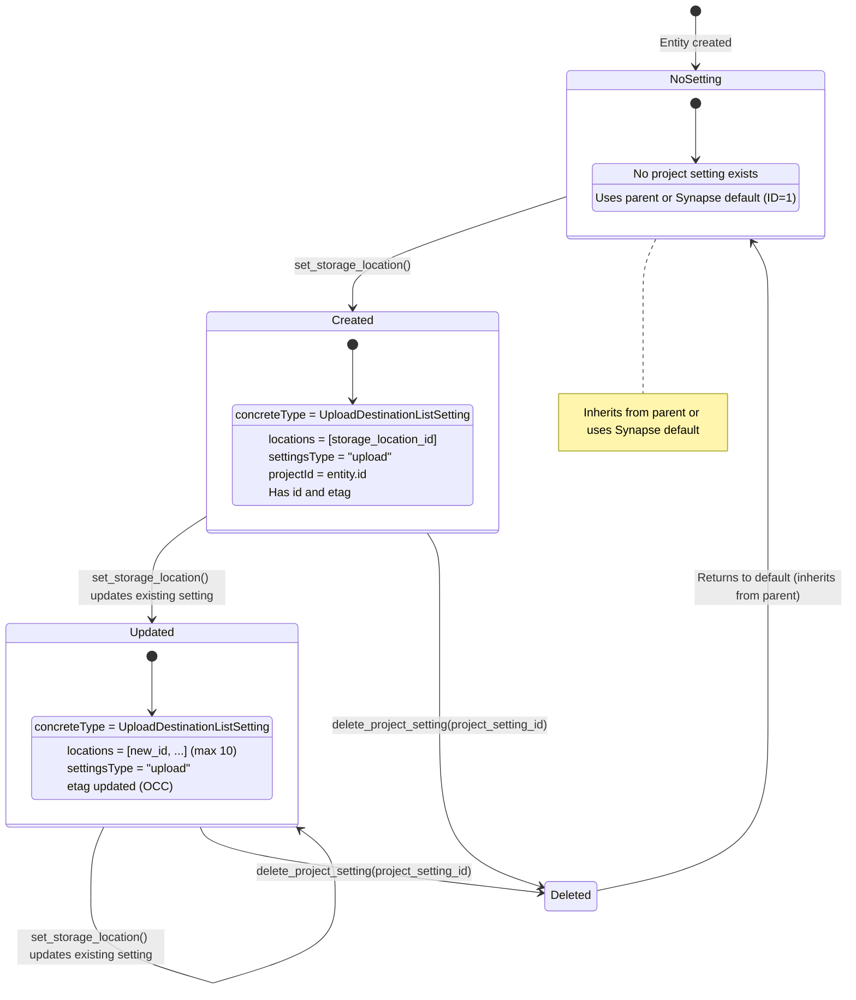
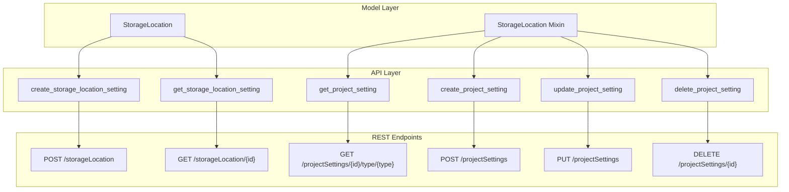
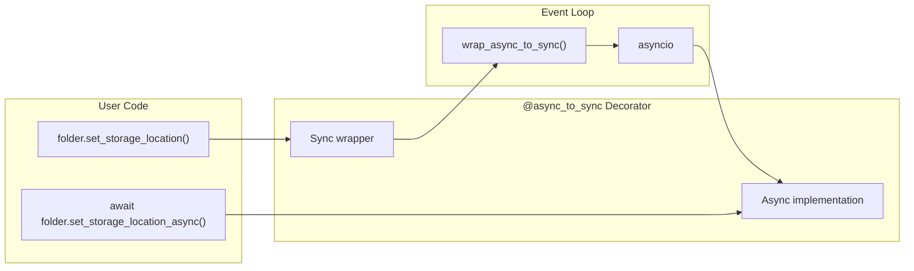
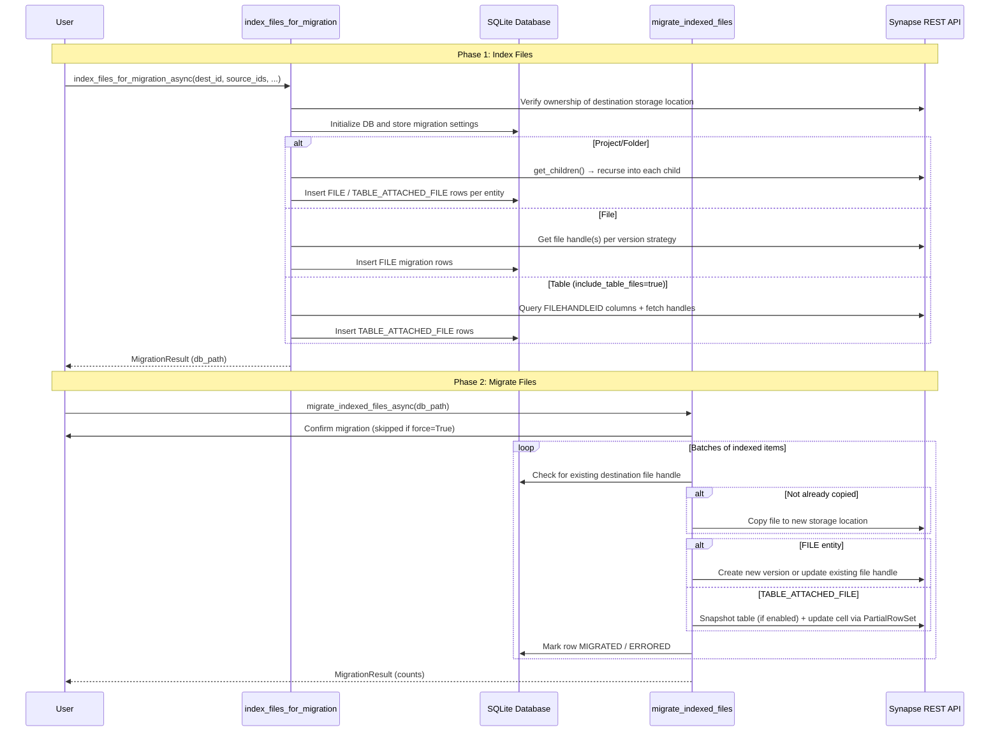

# Storage Location Architecture

This document provides an in-depth architectural overview of the StorageLocation
system in the Synapse Python Client. It explains the design decisions, class
relationships, and data flows that enable flexible storage configuration.

---

## On This Page

-   **[Domain Model](#domain-model)**

    Core classes, enums, and their relationships

-   **[Storage Types](#storage-type-mapping)**

    How storage types map to REST API types and choosing the right one

-   **[Entity Inheritance](#entity-inheritance-hierarchy)**

    How Projects and Folders gain storage capabilities

-   **[Operation Flows](#operation-flows)**

    Sequence diagrams for store, setup, and STS operations

-   **[Settings & API](#project-setting-lifecycle)**

    Project settings lifecycle and REST API architecture

-   **[Migration](#migration-flow)**

    Two-phase file migration process

---

## Overview

The StorageLocation setting enables Synapse users to configure a location where files are uploaded to and downloaded from via Synapse.
By default, Synapse stores files in its internal S3 storage, but
users can configure projects and folders to use external storage backends such as
AWS S3 buckets, Google Cloud Storage, SFTP servers, or a local file server using a proxy server.

### Key Concepts
- [**StorageLocationSetting**](https://rest-docs.synapse.org/rest/org/sagebionetworks/repo/model/project/StorageLocationSetting.html): A configuration specifying file storage and download locations.
- [**ProjectSetting**](https://rest-docs.synapse.org/rest/org/sagebionetworks/repo/model/project/ProjectSetting.html): A configuration applied to projects that allows customization of file storage locations.
- [**UploadType**](https://rest-docs.synapse.org/rest/org/sagebionetworks/repo/model/file/UploadType.html): An enumeration that defines the types of file upload destinations that Synapse supports.
- **STS Credentials**: Temporary AWS credentials for direct S3 access.
- **StorageLocation Migration**: The process of transferring the files associated with Synapse entities between storage locations while preserving the entities’ structure and identifiers.

---

 

# Part 1: Data Model

This section covers the core classes, enumerations, and type mappings.

 

## Domain Model

The following class diagram shows the core classes and their relationships in the
StorageLocation system.

 

### Key Components

| Component | Description |
|-----------|-------------|
| [synapseclient.models.StorageLocation] | The model representing a storage location setting in Synapse |
| [synapseclient.models.StorageLocationType] | Enumeration defining the supported storage backend types |
| [synapseclient.models.UploadType] | Enumeration defining the upload protocol for each storage type |
| [synapseclient.models.mixins.StorageLocationConfigurable] | Mixin providing STS token and file migration methods |
| [synapseclient.models.mixins.ProjectSettingsMixin] | Mixin extending `StorageLocationConfigurable` with storage location and project settings management |
| [synapseclient.models.ProjectSetting] | Dataclass representing a project's upload destination configuration, backed by `UploadDestinationListSetting` in the REST API |

---

 

## Storage Type Mapping

Each `StorageLocationType` maps to a specific REST API `concreteType` and has a
default `UploadType`. This mapping allows the system to parse
responses from the API and construct requests.

 

### Storage Type Attributes

Different storage types support different configuration attributes:

| Attribute | Type | S3StorageLocationSetting | ExternalS3StorageLocationSetting | ExternalObjectStorageLocationSetting | ExternalStorageLocationSetting | ExternalGoogleCloudStorageLocationSetting | ProxyStorageLocationSettings |
|-----------|------|--------------------------|----------------------------------|--------------------------------------|--------------------------------|-------------------------------------------|------------------------------|
| **Common (all types)** |
| `concreteType` | string (enum) | ✓ (required) | ✓ (required) | ✓ (required) | ✓ (required) | ✓ (required) | ✓ (required) |
| `storageLocationId` | integer (int32) | ✓ | ✓ | ✓ | ✓ | ✓ | ✓ |
| `uploadType` | string | ✓ | ✓ | ✓ | ✓ | ✓ | ✓ |
| `banner` | string | ✓ | ✓ | ✓ | ✓ | ✓ | ✓ |
| `description` | string | ✓ | ✓ | ✓ | ✓ | ✓ | ✓ |
| `etag` | string | ✓ | ✓ | ✓ | ✓ | ✓ | ✓ |
| `createdOn` | string | ✓ | ✓ | ✓ | ✓ | ✓ | ✓ |
| `createdBy` | integer (int32) | ✓ | ✓ | ✓ | ✓ | ✓ | ✓ |
| **Type-specific** |
| `baseKey` | string | ✓ | ✓ | — | — | ✓ | — |
| `stsEnabled` | boolean | ✓ | ✓ | — | — | — | — |
| `bucket` | string | — | ✓ (required) | ✓ (required) | — | ✓ (required) | — |
| `endpointUrl` | string | — | ✓ | ✓ (required) | — | — | — |
| `url` | string | — | — | — | ✓ (required) | — | — |
| `supportsSubfolders` | boolean | — | — | — | ✓ | — | — |
| `proxyUrl` | string | — | — | — | — | — | ✓ (required) |
| `secretKey` | string | — | — | — | — | — | ✓ (required) |
| `benefactorId` | string | — | — | — | — | — | ✓ (required) |

## Summary by type

| Setting type | Description | Type-specific attributes |
|--------------|-------------|---------------------------|
| **S3StorageLocationSetting** | Default Synapse storage on Amazon S3. | `baseKey`, `stsEnabled` |
| **ExternalS3StorageLocationSetting** | External S3 bucket connected with Synapse (Synapse-accessed). | `bucket` (required), `baseKey`, `stsEnabled`, `endpointUrl` |
| **ExternalObjectStorageLocationSetting** | S3-compatible object storage **not** accessed by Synapse. | `bucket` (required), `endpointUrl` (required) |
| **ExternalStorageLocationSetting** | SFTP or HTTPS upload destination. | `url` (required), `supportsSubfolders` |
| **ExternalGoogleCloudStorageLocationSetting** | External Google Cloud Storage bucket connected with Synapse. | `bucket` (required), `baseKey` |
| **ProxyStorageLocationSettings** | HTTPS proxy for all upload/download operations. | `proxyUrl` (required), `secretKey` (required), `benefactorId` (required) |

 

### Choosing a Storage Type

Use this decision tree to select the appropriate storage type for your use case:

---

 

## Entity Inheritance Hierarchy

Projects and Folders inherit storage configuration capabilities through two
cooperating mixins: `StorageLocationConfigurable` (STS tokens and file migration)
and `ProjectSettingsMixin` (storage location and project settings management).
This pattern allows consistent storage management across container entities.

The mixin pattern allows `Project` and `Folder` to share storage location
functionality without code duplication. Both classes inherit all methods
from `ProjectSettingsMixin`, which itself extends `StorageLocationConfigurable`.

---

 
 

# Part 2: Operation Flows

This section contains sequence diagrams for key operations.

 

## Operation Flows

### Store Operation

The `store()` method creates a new storage location in Synapse. Creating a storage location is idempotent per user. Repeating a creation request with the same properties will return the previously created storage location rather than creating a new one.

 

### STS Token Retrieval

STS (AWS Security Token Service) enables direct S3 access using temporary credentials.

When a Synapse client is constructed (`Synapse.__init__`), it creates an in-memory token cache:

- `self._sts_token_store = sts_transfer.StsTokenStore()` (see `synapseclient/client.py`)

 

#### Credential Output Formats

| Format | Description | Use Case |
|--------|-------------|----------|
| `boto` | Dict with `aws_access_key_id`, `aws_secret_access_key`, `aws_session_token` | Pass directly to `boto3.client('s3', **creds)` |
| `json` | JSON string | Store or pass to external tools |
| `shell` / `bash` | `export AWS_ACCESS_KEY_ID=...` format | Execute in shell |
| `cmd` | Windows SET commands | Windows command prompt |
| `powershell` | PowerShell variable assignments | PowerShell scripts |

---

 
 

# Part 3: Settings & Infrastructure

This section covers project settings, API architecture, and the async/sync pattern.

 

## Project Setting Lifecycle

Project settings control which storage location(s) are used for uploads to an
entity. The following state diagram shows the lifecycle of a project setting.

 

### Setting Types

| Type | Purpose | Status |
|------|---------|--------|
| `upload` | Configures upload destination storage location(s) | **Supported** |

Other setting types may be added in the future.

---

 

## API Layer Architecture

The storage location services module provides async functions that wrap the
Synapse REST API endpoints. This layer handles serialization and error handling.

 

### REST API Reference

| Method | Endpoint | Description |
|--------|----------|-------------|
| POST | `/storageLocation` | Create a new storage location setting |
| GET | `/storageLocation/{id}` | Retrieve a storage location by ID |
| GET | `/projectSettings/{projectId}/type/{type}` | Get project settings for an entity |
| POST | `/projectSettings` | Create a new project setting |
| PUT | `/projectSettings` | Update an existing project setting |
| DELETE | `/projectSettings/{id}` | Delete a project setting |

---

 

## Async/Sync Pattern

The StorageLocation system follows the Python client's `@async_to_sync` pattern,
providing both async and sync versions of all methods.

 

### Method Pairs

| Sync Method | Async Method |
|-------------|--------------|
| `StorageLocation.store()` | `StorageLocation.store_async()` |
| `StorageLocation.get()` | `StorageLocation.get_async()` |
| `StorageLocation.setup_s3()` | `StorageLocation.setup_s3_async()` |
| `folder.set_storage_location()` | `folder.set_storage_location_async()` |
| `folder.get_project_setting()` | `folder.get_project_setting_async()` |
| `folder.delete_project_setting()` | `folder.delete_project_setting_async()` |
| `folder.get_sts_storage_token()` | `folder.get_sts_storage_token_async()` |
| `folder.index_files_for_migration()` | `folder.index_files_for_migration_async()` |
| `folder.migrate_indexed_files()` | `folder.migrate_indexed_files_async()` |

---

 
 

# Part 4: Migration

This section covers the file migration system.

 

## Migration Flow

File migration is a two-phase process that first indexes all candidate files and then performs an asynchronous, batched migration that reuses copied file handles where possible, respects concurrency limits, snapshots affected tables when needed, and updates entities and table cells via transactional table operations while recording per-item status in a SQLite database.

 

### Migration Strategies

| Strategy | Description |
|----------|-------------|
| `new` | Create new file versions in destination (default) |
| `all` | Migrate all versions of each file |
| `latest` | Only migrate the latest version |
| `skip` | Skip if file already exists in destination |

---

 
 

# Learn More

| Resource | Description |
|----------|-------------|
| [Storage Location Tutorial](../tutorials/python/storage_location.md) | Step-by-step guide to using storage locations |
| [StorageLocation API Reference][synapseclient.models.StorageLocation] | Complete API documentation |
| [ProjectSettingsMixin][synapseclient.models.mixins.ProjectSettingsMixin] | Mixin methods for Projects and Folders |
| [Custom Storage Locations (Synapse Docs)](https://help.synapse.org/docs/Custom-Storage-Locations.2048327803.html) | Official Synapse documentation |
