# Table

Contained within this file are experimental interfaces for working with the Synapse Python
Client. Unless otherwise noted these interfaces are subject to change at any time. Use
at your own risk.

## API Reference

{ #table-reference-async }
::: synapseclient.models.Table
    options:
        inherited_members: true
        members:
        - get_async
        - store_async
        - delete_async
        - query_async
        - query_part_mask_async
        - store_rows_async
        - upsert_rows_async
        - delete_rows_async
        - snapshot_async
        - delete_column
        - add_column
        - reorder_column
        - get_permissions_async
        - get_acl_async
        - set_permissions_async
        - delete_permissions_async
        - list_acl_async

{ #column-reference-async }
::: synapseclient.models.Column
    options:
        members:

{ #schema-storage-strategy-reference-async }
::: synapseclient.models.SchemaStorageStrategy
{ #column-expansion-strategy-reference-async }
::: synapseclient.models.ColumnExpansionStrategy

{ #facet-type-reference-async }
::: synapseclient.models.FacetType
{ #column-type-reference-async }
::: synapseclient.models.ColumnType
{ #json-sub-column-reference-async }
::: synapseclient.models.JsonSubColumn

{ #column-change-reference-async }
::: synapseclient.models.ColumnChange
{ #partial-row-reference-async }
::: synapseclient.models.PartialRow
{ #partial-row-set-reference-async }
::: synapseclient.models.PartialRowSet
{ #table-schema-change-request-reference-async }
::: synapseclient.models.TableSchemaChangeRequest
{ #appendable-row-set-request-reference-async }
::: synapseclient.models.AppendableRowSetRequest
{ #upload-to-table-request-reference-async }
::: synapseclient.models.UploadToTableRequest
{ #table-update-transaction-reference-async }
::: synapseclient.models.TableUpdateTransaction
{ #csv-table-descriptor-reference-async }
::: synapseclient.models.CsvTableDescriptor
{ #csv-to-pandas-df-reference-async }
::: synapseclient.models.mixins.table_components.csv_to_pandas_df

## delete_permissions_async Flow Diagram

The following sequence diagram illustrates the complete flow and function calls of the `delete_permissions_async` method:

```mermaid
sequenceDiagram
    participant User as User/Client
    participant Entity as Entity (File/Folder/Project)
    participant Tracker as BenefactorTracker
    participant SynClient as Synapse Client
    participant API as Synapse API
    participant Logger as Logger

    User->>Entity: delete_permissions_async(params)

    Note over Entity: Parameter Validation & Setup
    Entity->>Entity: Validate entity.id exists
    Entity->>SynClient: get_client()

    alt Project Entity
        Entity->>Logger: warn("Project ACL cannot be deleted")
        Entity->>Entity: set include_self=False
    end

    Entity->>Entity: _normalize_target_entity_types()
    Entity->>Tracker: create BenefactorTracker()

    alt Recursive or Container Content Processing
        Entity->>Entity: _collect_entities()
        Note over Entity: Gather all entities to process

        Entity->>Tracker: track_entity_benefactor(entity_ids)

        loop For each entity_id
            Tracker->>API: get_entity_benefactor(entity_id)
            API-->>Tracker: benefactor_result
        end

        Note over Tracker: Build benefactor relationships
        Tracker->>Tracker: Update entity_benefactors mapping
        Tracker->>Tracker: Update benefactor_children mapping
    end

    alt Dry Run Mode
        Entity->>Entity: _build_and_log_dry_run_tree()
        Entity->>Logger: Log what would be deleted
        Entity-->>User: Return (no actual deletion)
    else Actual Deletion

        alt Include Self
            Entity->>Entity: _delete_current_entity_acl()

            Entity->>Tracker: track_entity_benefactor([self.id])
            Tracker->>API: get_entity_benefactor(self.id)
            API-->>Tracker: benefactor_result

            Entity->>Tracker: will_acl_deletion_affect_others(self.id)
            Tracker-->>Entity: boolean result

            alt Will Affect Others
                Entity->>Logger: info("Deleting ACL will affect X entities")
            end

            Entity->>API: delete_entity_acl(self.id)

            alt Success
                API-->>Entity: Success
                Entity->>Logger: debug("Deleted ACL for entity")
                Entity->>Tracker: mark_acl_deleted(self.id)
                Tracker->>Tracker: Update benefactor relationships
                Tracker-->>Entity: affected_entities list

                alt Has Affected Entities
                    Entity->>Logger: info("ACL deletion caused X entities to inherit from new benefactor")
                end
            else HTTP Error
                API-->>Entity: SynapseHTTPError
                alt Already Inherits (403)
                    Entity->>Logger: debug("Entity already inherits permissions")
                else Other Error
                    Entity->>Entity: raise exception
                end
            end
        end

        alt Process Container Contents
            Entity->>Entity: _process_container_contents()

            alt Process Files
                loop For each file
                    Entity->>Entity: file.delete_permissions_async(recursive=False)
                    Note right of Entity: Recursive call for each file
                end
            end

            alt Process Folders
                Entity->>Entity: _process_folder_permission_deletion()

                loop For each folder
                    alt Recursive Mode
                        Entity->>Entity: folder.delete_permissions_async(recursive=True)
                    else Direct Mode
                        Entity->>Entity: folder.delete_permissions_async(recursive=False)
                    end
                    Note right of Entity: Recursive calls for folders
                end
            end
        end
    end

    Entity-->>User: Complete

    Note over User,Logger: Key Features:
    Note over User,Logger: • Async operations with asyncio.gather()
    Note over User,Logger: • Benefactor relationship tracking
    Note over User,Logger: • Recursive processing capabilities
    Note over User,Logger: • Dry run mode for preview
    Note over User,Logger: • Error handling for inheritance conflicts
    Note over User,Logger: • Cascading permission updates
```

### Key Components:

- **Entity**: The primary object (File, Folder, Project) whose permissions are being deleted
- **BenefactorTracker**: Manages benefactor relationships and tracks cascading changes
- **Synapse Client**: Handles API communication and logging
- **Synapse API**: REST endpoints for ACL operations (`delete_entity_acl`, `get_entity_benefactor`)
- **Logger**: Records operations, warnings, and debug information

### Flow Highlights:

1. **Validation Phase**: Parameter validation and client setup
2. **Collection Phase**: Gathering entities for recursive operations
3. **Tracking Phase**: Parallel benefactor relationship discovery
4. **Preview Phase**: Dry run mode shows what would be deleted
5. **Deletion Phase**: Actual ACL deletions with error handling
6. **Cascading Phase**: Updates benefactor relationships for affected entities
