# AccessControllable

## delete_permissions Flow Diagram

The following sequence diagram illustrates the complete flow and function calls of the `delete_permissions` method:

```mermaid
sequenceDiagram
    participant User as User/Client
    participant Entity as Entity (File/Folder/Project)
    participant Tracker as BenefactorTracker
    participant SynClient as Synapse Client
    participant API as Synapse API
    participant Logger as Logger

    User->>Entity: delete_permissions(params)

    Note over Entity: Parameter Validation & Setup
    Entity->>Entity: Validate entity.id exists
    Entity->>SynClient: get_client()

    alt Project Entity
        Entity->>Logger: warn("Project ACL cannot be deleted")
        Entity->>Entity: set include_self=False
    end

    Entity->>Entity: _normalize_target_entity_types()
    Entity->>Tracker: create BenefactorTracker()

    alt Recursive or Container Content Processing
        Entity->>Entity: _collect_entities()
        Note over Entity: Gather all entities to process

        Entity->>Tracker: track_entity_benefactor(entity_ids)

        loop For each entity_id
            Tracker->>API: get_entity_benefactor(entity_id)
            API-->>Tracker: benefactor_result
        end

        Note over Tracker: Build benefactor relationships
        Tracker->>Tracker: Update entity_benefactors mapping
        Tracker->>Tracker: Update benefactor_children mapping
    end

    alt Dry Run Mode
        Entity->>Entity: _build_and_log_dry_run_tree()
        Entity->>Logger: Log what would be deleted
        Entity-->>User: Return (no actual deletion)
    else Actual Deletion

        alt Include Self
            Entity->>Entity: _delete_current_entity_acl()

            Entity->>Tracker: track_entity_benefactor([self.id])
            Tracker->>API: get_entity_benefactor(self.id)
            API-->>Tracker: benefactor_result

            Entity->>Tracker: will_acl_deletion_affect_others(self.id)
            Tracker-->>Entity: boolean result

            alt Will Affect Others
                Entity->>Logger: info("Deleting ACL will affect X entities")
            end

            Entity->>API: delete_entity_acl(self.id)

            alt Success
                API-->>Entity: Success
                Entity->>Logger: debug("Deleted ACL for entity")
                Entity->>Tracker: mark_acl_deleted(self.id)
                Tracker->>Tracker: Update benefactor relationships
                Tracker-->>Entity: affected_entities list

                alt Has Affected Entities
                    Entity->>Logger: info("ACL deletion caused X entities to inherit from new benefactor")
                end
            else HTTP Error
                API-->>Entity: SynapseHTTPError
                alt Already Inherits (403)
                    Entity->>Logger: debug("Entity already inherits permissions")
                else Other Error
                    Entity->>Entity: raise exception
                end
            end
        end

        alt Process Container Contents
            Entity->>Entity: _process_container_contents()

            alt Process Files
                loop For each file
                    Entity->>Entity: file.delete_permissions_async(recursive=False)
                    Note right of Entity: Recursive call for each file
                end
            end

            alt Process Folders
                Entity->>Entity: _process_folder_permission_deletion()

                loop For each folder
                    alt Recursive Mode
                        Entity->>Entity: folder.delete_permissions_async(recursive=True)
                    else Direct Mode
                        Entity->>Entity: folder.delete_permissions_async(recursive=False)
                    end
                    Note right of Entity: Recursive calls for folders
                end
            end
        end
    end

    Entity-->>User: Complete

    Note over User,Logger: Key Features:
    Note over User,Logger: • Async operations with asyncio.gather()
    Note over User,Logger: • Benefactor relationship tracking
    Note over User,Logger: • Recursive processing capabilities
    Note over User,Logger: • Dry run mode for preview
    Note over User,Logger: • Error handling for inheritance conflicts
    Note over User,Logger: • Cascading permission updates
```

### Key Components:

- **Entity**: The primary object (File, Folder, Project) whose permissions are being deleted
- **BenefactorTracker**: Manages benefactor relationships and tracks cascading changes
- **Synapse Client**: Handles API communication and logging
- **Synapse API**: REST endpoints for ACL operations (`delete_entity_acl`, `get_entity_benefactor`)
- **Logger**: Records operations, warnings, and debug information

### Flow Highlights:

1. **Validation Phase**: Parameter validation and client setup
2. **Collection Phase**: Gathering entities for recursive operations
3. **Tracking Phase**: Parallel benefactor relationship discovery
4. **Preview Phase**: Dry run mode shows what would be deleted
5. **Deletion Phase**: Actual ACL deletions with error handling
6. **Cascading Phase**: Updates benefactor relationships for affected entities

::: synapseclient.models.mixins.AccessControllable

---

::: synapseclient.models.protocols.access_control_protocol.AccessControllableSynchronousProtocol
