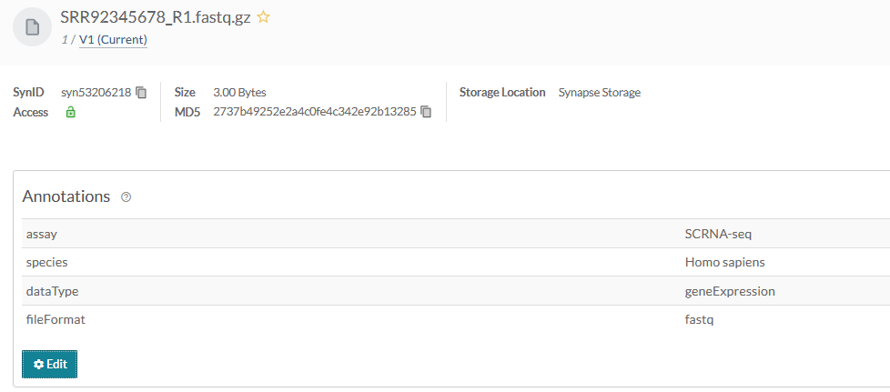

# Annotations
Annotations help users search for and find data, and they are a powerful tool used to systematically group and/or describe things in Synapse.

Annotations are stored as key-value pairs in Synapse, where the key defines a particular aspect of your data, for example (`species`, `assay`, `fileFormat`) and the value defines a variable that belongs to that category (`mouse`, `RNAseq`, `.bam`). You can use annotations to add additional information about a project, file, folder, table, or view.

Annotations can be based on an existing ontology or controlled vocabulary, or can be created as needed and modified later as your metadata evolves.


**Note:** You may optionally follow the [Uploading data in bulk](./upload_data_in_bulk.md)
tutorial instead. The bulk tutorial may fit your needs better as it limits the amount
of code that you are required to write and maintain.


## Tutorial Purpose
In this tutorial you will:

1. Add several annotations to stored files
1. Upload 2 new files and set the annotations at the same time

## Prerequisites
* Make sure that you have completed the [File](./file.md) tutorial or have at least 1 file in your Synapse project.


## 1. Add several annotations to stored files

#### First let's retrieve all of the Synapse IDs we are going to use
```python
{!docs/tutorials/python/tutorial_scripts/annotation.py!lines=5-22}
```

#### Next let's define the annotations I want to set

```python
{!docs/tutorials/python/tutorial_scripts/annotation.py!lines=25-31}
```

#### Finally we'll loop over all of the files and set their annotations

```python
{!docs/tutorials/python/tutorial_scripts/annotation.py!lines=33-51}
```


<details class="example">
  <summary>You'll see that each file now has a number of annotations:</summary>

```
Batch 1 Folder ID: syn53205629
Got the annotations for File: SRR12345678_R1.fastq.gz, ID: syn53205687, Annotations: {}
Set the annotations for File: SRR12345678_R1.fastq.gz, ID: syn53205687, Annotations: {'assay': ['SCRNA-seq'], 'species': ['Homo sapiens'], 'dataType': ['geneExpression'], 'fileFormat': ['fastq']}
Got the annotations for File: SRR12345678_R2.fastq.gz, ID: syn53205688, Annotations: {}
Set the annotations for File: SRR12345678_R2.fastq.gz, ID: syn53205688, Annotations: {'assay': ['SCRNA-seq'], 'species': ['Homo sapiens'], 'dataType': ['geneExpression'], 'fileFormat': ['fastq']}
```
</details>


## 2. Upload 2 new files and set the annotations at the same time

Assuming we have a few new files we want to upload we'll follow a similar pattern defined
in the [File tutorial](./file.md), except now we'll specify the `annotations` attribute before
uploading the file to Synapse.

In order for the following script to work please replace the files with ones that
already exist on your local machine.

```python
{!docs/tutorials/python/tutorial_scripts/annotation.py!lines=53-78}
```

<details class="example">
  <summary>You'll notice the output looks like:</summary>
```
Stored file: SRR92345678_R1.fastq.gz, ID: syn53206218, Annotations: {
  "assay": [
    "SCRNA-seq"
  ],
  "dataType": [
    "geneExpression"
  ],
  "fileFormat": [
    "fastq"
  ],
  "species": [
    "Homo sapiens"
  ]
}
Stored file: SRR92345678_R2.fastq.gz, ID: syn53206219, Annotations: {
  "assay": [
    "SCRNA-seq"
  ],
  "dataType": [
    "geneExpression"
  ],
  "fileFormat": [
    "fastq"
  ],
  "species": [
    "Homo sapiens"
  ]
}
```
</details>

## Results

Now that you have annotated your files you'll be able to inspect this on the individual
files in the synapse web UI. It should look similar to:




## Source code for this tutorial

<details class="quote">
  <summary>Click to show me</summary>

```python
{!docs/tutorials/python/tutorial_scripts/annotation.py!}
```
</details>

## References used in this tutorial

- [Annotations][synapseclient.Annotations]
- [File][file-reference-sync]
- [syn.login][synapseclient.Synapse.login]
- [syn.findEntityId][synapseclient.Synapse.findEntityId]
- [syn.getChildren][synapseclient.Synapse.getChildren]
- [syn.get_annotations][synapseclient.Synapse.get_annotations]
- [syn.set_annotations][synapseclient.Synapse.set_annotations]
- [syn.store][synapseclient.Synapse.store]
