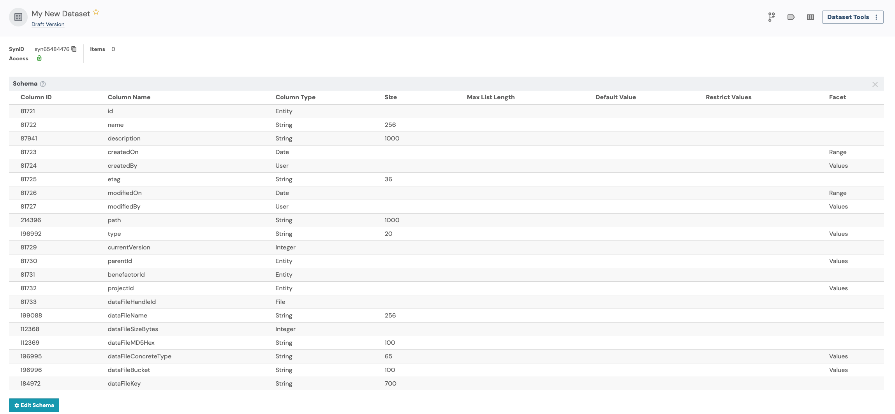
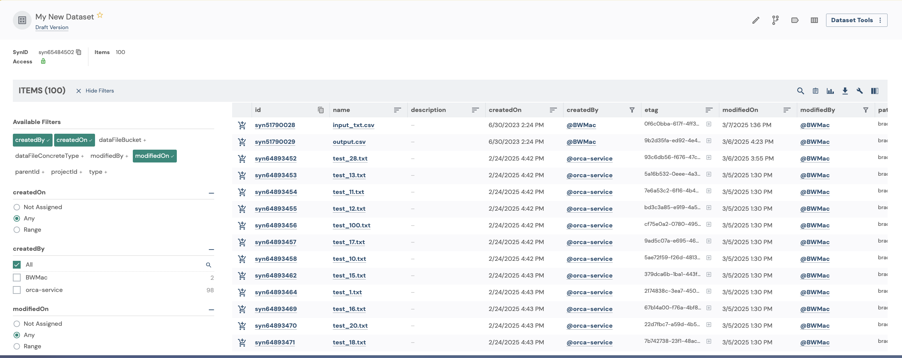

# Datasets
Datasets in Synapse are a way to organize, annotate, and publish sets of files for others to use. Datasets behave similarly to Tables and EntityViews, but provide some default behavior that makes it easy to put a group of files together.

This tutorial will walk through basics of working with datasets using the Synapse Python Client.

# Tutorial Purpose
In this tutorial, you will:

1. Create a dataset
2. Add files to the dataset
3. Query the dataset
4. Add a custom column to the dataset
6. Save a snapshot of the dataset

# Prerequisites
* This tutorial assumes that you have a project in Synapse with one or more files in it. To test all of the ways to add files to a dataset, you will need to have at least 3 files in your project. A structure like this is recommended:
    ```
    Project
    ├── File 1
    ├── File 2
    ├── Folder 1
    │   ├── File 4
    │   ├── ...
    ```
* Pandas must be installed as shown in the [installation documentation](../installation.md)

## 1. Get the ID of your Synapse project

Let's get started by authenticating with Synapse and retrieving the ID of your project.

```python
{!docs/tutorials/python/tutorial_scripts/dataset.py!lines=3-24}
```

## 2. Create your Dataset

Next, we will create the dataset. We will use the project ID to tell Synapse where we want the dataset to be created. After this step, we will have a Dataset object with all of the needed information to start building the dataset.

```python
{!docs/tutorials/python/tutorial_scripts/dataset.py!lines=29-30}
```

Because we haven't added any files to the dataset yet, it will be empty, but if you view the dataset's schema in the UI, you will notice that datasets come with default columns that help to describe each file that we add to the dataset.



## 3. Add files to the dataset

Let's add some files to the dataset now. There are three ways to add files to a dataset:

1. Add an Entity Reference to a file with its ID and version
```python
{!docs/tutorials/python/tutorial_scripts/dataset.py!lines=34-36}
```
2. Add a File with its ID and version
```python
{!docs/tutorials/python/tutorial_scripts/dataset.py!lines=38-40}
```
3. Add a Folder. When adding a folder, all child files inside of the folder are added to the dataset recursively.
```python
{!docs/tutorials/python/tutorial_scripts/dataset.py!lines=42-44}
```

Whenever we make changes to the dataset, we need to call the `store()` method to save the changes to Synapse.
```python
{!docs/tutorials/python/tutorial_scripts/dataset.py!lines=46}
```

And now we are able to see our dataset with all of the files that we added to it.



## 4. Retrieve the dataset

Now that we have a dataset with some files in it, we can retrieve the dataset from Synapse the next time we need to use it.

```python
{!docs/tutorials/python/tutorial_scripts/dataset.py!lines=50-52}
```

## 5. Query the dataset

Now that we have a dataset with some files in it, we can query the dataset to find files that match certain criteria.

```python
{!docs/tutorials/python/tutorial_scripts/dataset.py!lines=56-59}
```

## 6. Add a custom column to the dataset

We can also add a custom column to the dataset. This will allow us to annotate files in the dataset with additional information.

```python
{!docs/tutorials/python/tutorial_scripts/dataset.py!lines=63-69}
```

Our custom column isn't all that useful empty, so let's update the dataset with some values.

```python
{!docs/tutorials/python/tutorial_scripts/dataset.py!lines=72-80}
```

## 7. Save a snapshot of the dataset

Finally, let's save a snapshot of the dataset. This creates a read-only version of the dataset that captures the current state of the dataset and can be referenced later.

```python
{!docs/tutorials/python/tutorial_scripts/dataset.py!lines=84-88}
```

## Source Code for this Tutorial

<details class="quote">
  <summary>Click to show me</summary>

```python
{!docs/tutorials/python/tutorial_scripts/dataset.py!}
```
</details>

## References
- [Dataset][dataset-reference-sync]
- [Column][column-reference-sync]
- [syn.login][synapseclient.Synapse.login]
- [Project][project-reference-sync]
- [query examples](https://rest-docs.synapse.org/rest/org/sagebionetworks/repo/web/controller/TableExamples.html)
