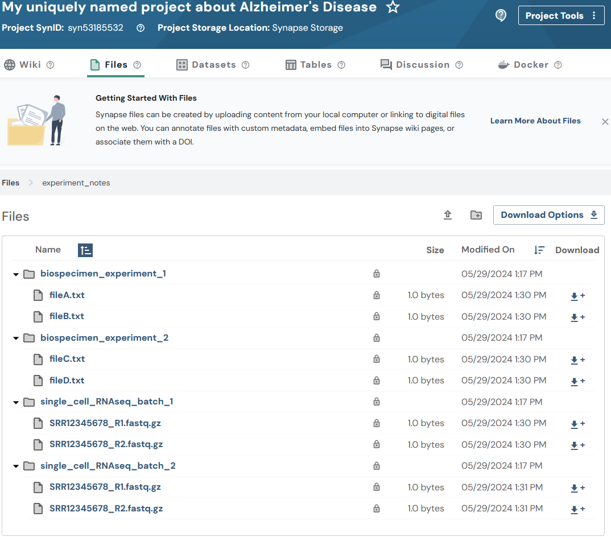

# Files in Synapse
Synapse files can be created by uploading content from your local computer or linking to digital files on the web.

Files in Synapse always have a “parent”, which could be a project or a folder. You can organize collections of files into folders and sub-folders, just as you would on your local computer.

[Read more](../../explanations/domain_models_of_synapse.md#files)


**Note:** You may optionally follow the [Uploading data in bulk](./upload_data_in_bulk.md)
tutorial instead. The bulk tutorial may fit your needs better as it limits the amount
of code that you are required to write and maintain.


This tutorial will follow a [Flattened Data Layout](../../explanations/structuring_your_project.md#flattened-data-layout-example). With this example layout:
```
.
├── biospecimen_experiment_1
│   ├── fileA.txt
│   └── fileB.txt
├── biospecimen_experiment_2
│   ├── fileC.txt
│   └── fileD.txt
├── single_cell_RNAseq_batch_1
│   ├── SRR12345678_R1.fastq.gz
│   └── SRR12345678_R2.fastq.gz
└── single_cell_RNAseq_batch_2
    ├── SRR12345678_R1.fastq.gz
    └── SRR12345678_R2.fastq.gz
```

## Tutorial Purpose
In this tutorial you will:

1. Upload several files to Synapse
1. Print stored attributes about your files
1. List all Folders and Files within my project


## Prerequisites
* Make sure that you have completed the [Folder](./folder.md) tutorial.
* The tutorial assumes you have a number of files ready to upload. If you do not, create test or dummy files. You may also use [these dummy files used during the creation of these tutorials](https://github.com/Sage-Bionetworks/synapsePythonClient/tree/develop/docs/tutorials/sample_files/my_ad_project). These are text files with example file extensions that a researcher may be using.


## 1. Upload several files to Synapse

#### First let's retrieve all of the Synapse IDs we are going to use
```python
{!docs/tutorials/python/tutorial_scripts/file.py!lines=5-30}
```

#### Next let's create all of the File objects to upload content

```python
{!docs/tutorials/python/tutorial_scripts/file.py!lines=32-75}
```

#### Finally we'll store the files in Synapse

```python
{!docs/tutorials/python/tutorial_scripts/file.py!lines=77-85}
```


<details class="example">
  <summary>Each file being uploaded has an upload progress bar:</summary>

```
##################################################
 Uploading file to Synapse storage
##################################################

Uploading [####################]100.00%   2.0bytes/2.0bytes (1.8bytes/s) SRR12345678_R1.fastq.gz Done...
```

</details>


## 2. Print stored attributes about your files

```python
{!docs/tutorials/python/tutorial_scripts/file.py!lines=87-99}
```

<details class="example">
  <summary>You'll notice the output looks like:</summary>
```
My file ID is: syn53205687
The parent ID of my file is: syn53205629
I created my file on: 2023-12-28T21:55:17.971Z
The ID of the user that created my file is: 3481671
My file was last modified on: 2023-12-28T21:55:17.971Z
```
</details>


## 3. List all Folders and Files within my project

Now that your project has a number of Folders and Files let's explore how we can traverse the content stored within the Project.

```python
{!docs/tutorials/python/tutorial_scripts/file.py!lines=101-112}
```


<details class="example">
  <summary>The result of walking your project structure should look something like:</summary>
```
Directory (syn60109540): My uniquely named project about Alzheimer's Disease/biospecimen_experiment_1
Directory (syn60109543): My uniquely named project about Alzheimer's Disease/biospecimen_experiment_2
Directory (syn60109534): My uniquely named project about Alzheimer's Disease/single_cell_RNAseq_batch_1
Directory (syn60109537): My uniquely named project about Alzheimer's Disease/single_cell_RNAseq_batch_2
File (syn60115444): My uniquely named project about Alzheimer's Disease/biospecimen_experiment_1/fileA.txt
File (syn60115457): My uniquely named project about Alzheimer's Disease/biospecimen_experiment_1/fileB.txt
File (syn60115472): My uniquely named project about Alzheimer's Disease/biospecimen_experiment_2/fileC.txt
File (syn60115485): My uniquely named project about Alzheimer's Disease/biospecimen_experiment_2/fileD.txt
File (syn60115498): My uniquely named project about Alzheimer's Disease/single_cell_RNAseq_batch_1/SRR12345678_R1.fastq.gz
File (syn60115513): My uniquely named project about Alzheimer's Disease/single_cell_RNAseq_batch_1/SRR12345678_R2.fastq.gz
File (syn60115526): My uniquely named project about Alzheimer's Disease/single_cell_RNAseq_batch_2/SRR12345678_R1.fastq.gz
File (syn60115539): My uniquely named project about Alzheimer's Disease/single_cell_RNAseq_batch_2/SRR12345678_R2.fastq.gz
```
</details>


## Results
Now that you have created your files you'll be able to inspect this on the Files tab of your project in the synapse web UI. It should look similar to:




## Source code for this tutorial

<details class="quote">
  <summary>Click to show me</summary>

```python
{!docs/tutorials/python/tutorial_scripts/file.py!}
```
</details>

## References used in this tutorial

- [File][file-reference-sync]
- [syn.login][synapseclient.Synapse.login]
- [syn.findEntityId][synapseclient.Synapse.findEntityId]
- [syn.store][synapseclient.Synapse.store]
- [synapseutils.walk][]
