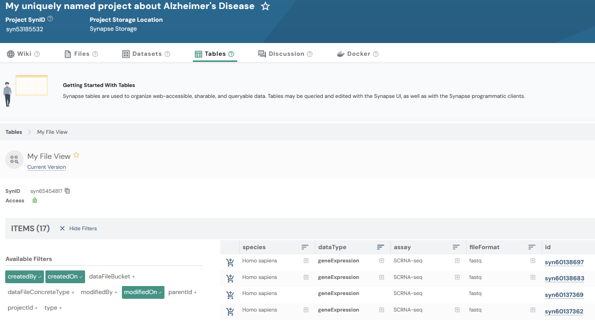

# FileViews
FileViews in Synapse allow you to create a queryable view that provides a unified selection
of entities stored in different locations within your Synapse project. This can be
particularly useful for managing and querying metadata across multiple files, folders,
or projects that you manage.

Views display rows and columns of information, and they can be shared and queried with
SQL. Views are queries of other data already in Synapse. They allow you to see groups
of entities including files, tables, folders, or datasets and any associated
annotations about those items.

Annotations are an essential component to building a view. Annotations are labels that
you apply to your data, stored as key-value pairs in Synapse. They help users search
for and find data, and they are a powerful tool used to systematically group and
describe things in Synapse.

This tutorial will follow a [Flattened Data Layout](../../explanations/structuring_your_project.md#flattened-data-layout-example). With a project that has this example layout:
```
.

└── single_cell_RNAseq_batch_1
    ├── SRR12345678_R1.fastq.gz
    └── SRR12345678_R2.fastq.gz
```

## Tutorial Purpose
In this tutorial you will:

1. Create a FileView with a number of columns
2. Query the FileView
3. Update rows in the FileView
4. Update the scope of your FileView
5. Update the types of entities in your FileView

## Prerequisites
* This tutorial assumes that you have a project in Synapse with one or more
files/folders. It does not need to match the given structure in this tutorial, but, if
you do not have this already set up you may reference the [Folder](./folder.md)
and [File](./file.md) tutorials.
* Pandas must be installed as shown in the [installation documentation](../installation.md)


## 1. Find the synapse ID of your project

First let's set up some constants we'll use in this script, and find the ID of our project
```python
{!docs/tutorials/python/tutorial_scripts/fileview.py!lines=5-22}
```

## 2. Create a FileView with Columns

Now, we will create 4 columns to add to our FileView. Recall that any data added to
these columns will be stored as an annotation on the underlying File.

```python
{!docs/tutorials/python/tutorial_scripts/fileview.py!lines=24-31}
```

Next we're going to store what we have to Synapse and print out the results

```python
{!docs/tutorials/python/tutorial_scripts/fileview.py!lines=33-47}
```

## 3. Query the FileView

```python
{!docs/tutorials/python/tutorial_scripts/fileview.py!lines=49-54}
```

<details class="example">
  <summary>The result of querying your File View should look like:</summary>
```
   id        name                       species         dataType...
0  syn1      SRR12345678_R1.fastq.gz    Homo sapiens    geneExpression
1  syn2      SRR12345678_R1.fastq.gz    Homo sapiens    geneExpression
```
</details>

## 4. Update rows in the FileView

Now that we know the data is present in the FileView, let's go ahead and update the
annotations on these Files. The following code sets all returned rows to a single
value. Since the results were returned as a Pandas DataFrame you have many
options to search through and set values on your data.

```python
{!docs/tutorials/python/tutorial_scripts/fileview.py!lines=56-66}
```

A note on `wait_for_eventually_consistent_view`: FileViews in Synapse are eventually
consistent, meaning that updates to data may take some time to be reflected in the
view. The `wait_for_eventually_consistent_view` flag allows the code to pause until
the changes are fully propagated to your FileView. When this flag is set to `True` a
query is automatically executed on the view to determine if the view contains the
updated changes. It will allow your next query on your view to reflect any changes that
you made. Conversely, if this is set to `False`, there is no guarantee that your next
query will reflect your most recent changes.

## 5. Update the scope of your FileView

As your project expands or contracts you will need to adjust the containers you'd like
to include in your view. In order to accomplish this you may modify the `scope_ids`
attribute on your view.

```python
{!docs/tutorials/python/tutorial_scripts/fileview.py!lines=69-73}
```

## 6. Update the types of Entities included in your FileView

You may also want to change what types of Entities may be included in your view. To
accomplish this you'll be modifying the `view_type_mask` attribute on your view.

```python
{!docs/tutorials/python/tutorial_scripts/fileview.py!lines=75-79}
```

## Results
Now that you have created and updated your File View, you can inspect it in the
Synapse web UI. It should look similar to:



## Source code for this tutorial

<details class="quote">
  <summary>Click to show me</summary>

```python
{!docs/tutorials/python/tutorial_scripts/fileview.py!}
```
</details>

## References used in this tutorial

- [FileView](../../reference/experimental/sync/fileview.md)
- [Column][synapseclient.models.Column]
- [syn.login][synapseclient.Synapse.login]
- [Project](../../reference/experimental/sync/project.md)
