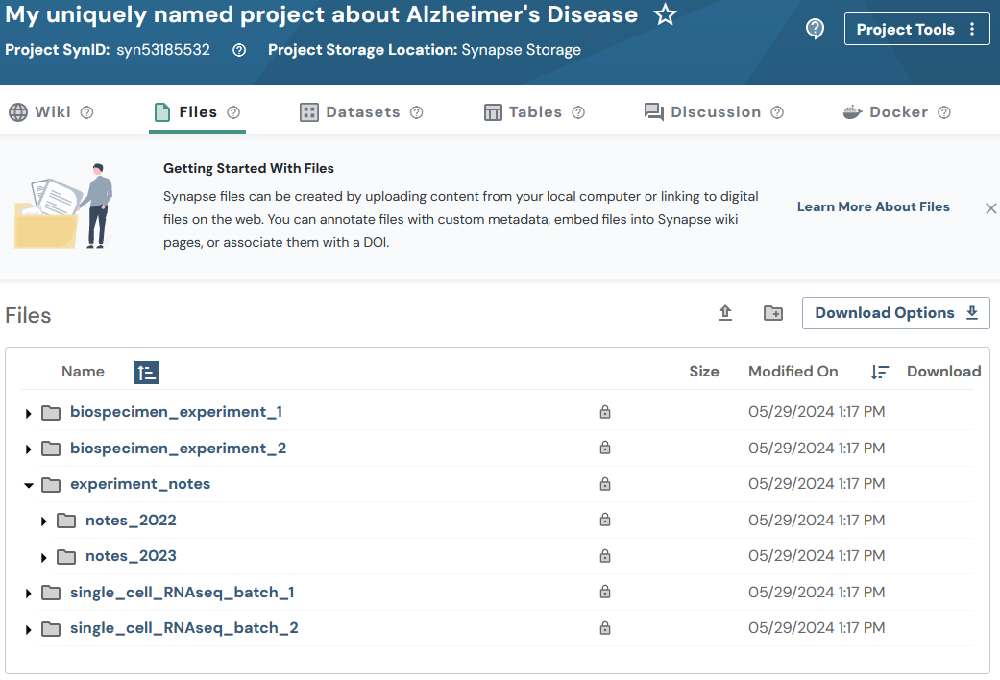

# Folders in Synapse
Similar to Projects, Folders are “containers” that offer an additional way to organize your data. Instead of uploading a bunch of single files into your project, you can create folders to separate your data in a systematic way.

Folders in Synapse always have a “parent”, which could be a project or a folder. You can organize collections of folders and sub-folders, just as you would on your local computer.

[Read more about Folders](../../explanations/domain_models_of_synapse.md#folders)


**Note:** You may optionally follow the [Uploading data in bulk](./upload_data_in_bulk.md)
tutorial instead. The bulk tutorial may fit your needs better as it limits the amount
of code that you are required to write and maintain.


This tutorial will follow a mix of
[Flattened Data Layout](../../explanations/structuring_your_project.md#flattened-data-layout-example)
and [Hierarchy Data Layout](../../explanations/structuring_your_project.md#hierarchy-data-layout-example).
It is recommended to use one or the other, but not both. Both are used in this tutorial
to demonstrate the flexibility of storing folders within folders on Synapse.
With this example layout:
```
.
├── experiment_notes
│   ├── notes_2022
│   │   ├── fileA.txt
│   │   └── fileB.txt
│   └── notes_2023
│       ├── fileC.txt
│       └── fileD.txt
├── biospecimen_experiment_1
│   ├── fileA.txt
│   └── fileB.txt
├── biospecimen_experiment_2
│   ├── fileC.txt
│   └── fileD.txt
├── single_cell_RNAseq_batch_1
│   ├── SRR12345678_R1.fastq.gz
│   └── SRR12345678_R2.fastq.gz
└── single_cell_RNAseq_batch_2
    ├── SRR12345678_R1.fastq.gz
    └── SRR12345678_R2.fastq.gz
```

## Tutorial Purpose
In this tutorial you will:

1. Create 4 new folders
1. Print stored attributes about your folder
1. Create 2 sub-folders


## Prerequisites
* Make sure that you have completed the [Project](./project.md) tutorial.


## 1. Create a new folder

```python
{!docs/tutorials/python/tutorial_scripts/folder.py!lines=5-35}
```

## 2. Print stored attributes about your folder

```python
{!docs/tutorials/python/tutorial_scripts/folder.py!lines=35-49}
```

<details class="example">
  <summary>You'll notice the output looks like:</summary>
```
My folder ID is: syn53205629
The parent ID of my folder is: syn53185532
I created my folder on: 2023-12-28T20:52:50.193Z
The ID of the user that created my folder is: 3481671
My folder was last modified on: 2023-12-28T20:52:50.193Z
```
</details>


## 3. Create 2 sub-folders

```python
{!docs/tutorials/python/tutorial_scripts/folder.py!lines=52-59}
```

## Results
Now that you have created your folders you'll be able to inspect this on the Files tab of your project in the synapse web UI. It should look similar to:




## Source code for this tutorial

<details class="quote">
  <summary>Click to show me</summary>

```python
{!docs/tutorials/python/tutorial_scripts/folder.py!}
```
</details>

## References used in this tutorial

- [Folder][folder-reference-sync]
- [syn.login][synapseclient.Synapse.login]
- [syn.findEntityId][synapseclient.Synapse.findEntityId]
- [syn.store][synapseclient.Synapse.store]
