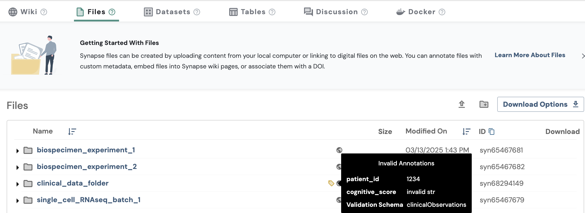
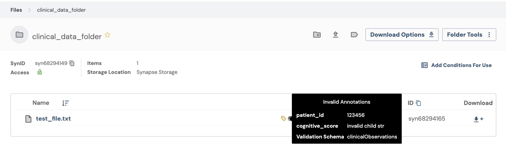

JSON Schema is a tool used to validate data. In Synapse, JSON Schemas can be used to validate the metadata applied to an entity such as project, file, folder, table, or view, including the [annotations](https://help.synapse.org/docs/Annotating-Data-With-Metadata.2667708522.html) applied to it. To learn more about JSON Schemas, check out [JSON-Schema.org](https://json-schema.org/). You can view a full list of entities supported by Synapse [here](https://rest-docs.synapse.org/rest/index.html#org.sagebionetworks.repo.web.controller.EntityController)

Synapse supports a subset of features from [json-schema-draft-07](https://json-schema.org/draft-07). To see the list of features currently supported, see the [JSON Schema object definition](https://rest-docs.synapse.org/rest/org/sagebionetworks/repo/model/schema/JsonSchema.html) from Synapse's REST API Documentation

In this tutorial, you will learn how to bind a JSON Schema to a folder, which allows you to enforce data standards on the folder and all its children. You can also bind a JSON Schema to a project, file, table, or view. This tutorial will walk you through each step, from binding a schema to validation.

## Tutorial Purpose
By the end of this tutorial, you will:

1. Log in and create a project and folder
2. Retrieve the JSON Schema and the organization that have already been created for the purpose of this tutorial
3. Bind the JSON Schema to a folder
4. Add annotations and validate against the schema
5. Attach and validate a file
6. View schema validation statistics and results

## Prerequisites
* You have a working [installation](../installation.md)of the Synapse Python Client.
* Make sure that you have completed the [Project](./project.md) tutorial, which covers creating and managing projects in Synapse. This is a prerequisite because you need a project to organize and store the folder used in this tutorial.
* You are familiar with Synapse concepts: [Project](./project.md), [Folder](./folder.md), [File](./file.md).
* You are familiar with [adding annotations](./annotation.md) to synapse entity.


## 1. Set Up Synapse Python Client and Retrieve Project

```python
{!docs/tutorials/python/tutorial_scripts/json_schema.py!lines=1-20}
```

## 2. Take a Look at the Constants and Structure of the JSON Schema

```python
{!docs/tutorials/python/tutorial_scripts/json_schema.py!lines=23-49}
```

Derived annotations allow you to define default values for annotations based on schema rules, ensuring consistency and reducing manual input errors. As you can see here, you could use derived annotations to prescribe default annotation values. Please read more about derived annotations [here](https://help.synapse.org/docs/JSON-Schemas.3107291536.html#JSONSchemas-DerivedAnnotations).


## 3. Try Create Test Organization and JSON Schema if They Do Not Exist
Next, try creating a test organization and register a schema if they do not already exist:
```python
{!docs/tutorials/python/tutorial_scripts/json_schema.py!lines=52-65}
```

Note: If you make an update to your schema, you can re-register your schema with the organization and give it a new version number:
```python
{!docs/tutorials/python/tutorial_scripts/json_schema.py!lines=68-90}
```

## 4. Bind the JSON Schema to the Folder
After creating the organization, you can now bind your json schema to a test folder. When you bind a JSON Schema to a project or folder, then all items inside of the project or folder will inherit the schema binding, unless the item has a schema bound to itself.

When you bind the schema, you may also include the boolean property `enable_derived_annos` to have Synapse automatically calculate derived annotations based on the schema:

```python
{!docs/tutorials/python/tutorial_scripts/json_schema.py!lines=94-100}
```

<details class="example">
<summary>You should be able to see: </summary>
```
JSON schema was bound successfully. Please see details below:
{'created_by': '<your synapse user id>',
 'created_on': '2025-06-13T21:46:37.457Z',
 'id': 'myUniqueAlzheimersResearchOrgTurtorial-clinicalObservations-0.0.1',
 'json_sha256_hex': 'f01270d61cf9a317b9f33a8acc1d86d330effc3548ad350c60d2a072de33f3fd',
 'organization_id': '571',
 'organization_name': 'myUniqueAlzheimersResearchOrgTurtorial',
 'schema_id': '5650',
 'schema_name': 'clinicalObservations',
 'semantic_version': '0.0.1',
 'version_id': '41294'}
```
</details>

## 5. Retrieve the Bound Schema
Next, we can retrieve the bound schema:
```python
{!docs/tutorials/python/tutorial_scripts/json_schema.py!lines=103-105}
```

<details class="example">
<summary>You should be able to see: </summary>
```
JSON Schema was retrieved successfully. Please see details below:
{'created_by': '<your synapse user id>',
'created_on': '2025-06-17T15:26:13.718Z',
'enable_derived_annotations': True,
'json_schema_version_info': JSONSchemaVersionInfo(
  organization_id='571',
  organization_name='myUniqueAlzheimersResearchOrgTurtorial',
  schema_id='5650',
  id='myUniqueAlzheimersResearchOrgTurtorial-clinicalObservations-0.0.1',
  schema_name='clinicalObservations',
  version_id='41294',
  semantic_version='0.0.1',
  json_sha256_hex='f01270d61cf9a317b9f33a8acc1d86d330effc3548ad350c60d2a072de33f3fd',
  created_on='2025-06-13T21:46:37.457Z',
  created_by='<your synapse user id>'),
'object_id': 68294149,
'object_type': 'entity'}
```
  </details>

## 6. Add Invalid Annotations to the Folder and Store, and Validate the Folder against the Schema
Try adding invalid annotations to your folder: This step and the step below demonstrate how the system handles invalid annotations and how the schema validation process works.
```python
{!docs/tutorials/python/tutorial_scripts/json_schema.py!lines=108-112}
```

Try validating the folder. You should be able to see messages related to invalid annotations.
```python
{!docs/tutorials/python/tutorial_scripts/json_schema.py!lines=116-118}
```


<details class="example">
<summary>You should be able to see: </summary>
```
Validation was completed. Please see details below:
{'all_validation_messages': ['#/cognitive_score: expected type: Integer, '
                             'found: String'],
 'validation_error_message': 'expected type: Integer, found: String',
 'validation_exception': ValidationException(pointer_to_violation='#/cognitive_score',
 message='expected type: Integer, '
          'found: String',
 schema_location='#/properties/cognitive_score',
 causing_exceptions=[]),
 'validation_response': JSONSchemaValidation(object_id='syn68294149',
 object_type='entity',
 object_etag='251af76f-56d5-49a2-aada-c268f24d699d',
 id='https://repo-prod.prod.sagebase.org/repo/v1/schema/type/registered/myUniqueAlzheimersResearchOrgTurtorial-clinicalObservations-0.0.1',
 is_valid=False,
 validated_on='2025-06-17T15:26:14.878Z')}
```
</details>

In the synapse web UI, you could also see your invalid annotations being marked by a yellow label similar to this:




## 7. Create a File with Invalid Annotations, Upload It, and View Validation Details

This step is only relevant for container entities, such as a folder or a project.

Try creating a test file locally and store the file in the folder that we created earlier. Then, try adding invalid annotations to a file. This step demonstrates how the files inside a folder also inherit the schema from the parent entity.
```python
{!docs/tutorials/python/tutorial_scripts/json_schema.py!lines=122-148}
```

You could then use `get_schema_validation_statistics` to get information such as the number of children with invalid annotations inside a container.
```python
{!docs/tutorials/python/tutorial_scripts/json_schema.py!lines=150-152}
```


<details class="example">
<summary>You should be able to see: </summary>
```
Validation statistics were retrieved successfully. Please see details below:
{'container_id': 'syn68294149',
'number_of_invalid_children': 1,
'number_of_unknown_children': 0,
'number_of_valid_children': 0,
'total_number_of_children': 1}
```
</details>


You could also use `get_invalid_validation` to see more detailed results of all the children inside a container, which includes all validation messages and validation exception details.
```python
{!docs/tutorials/python/tutorial_scripts/json_schema.py!lines=154-159}
```

<details class="example">
<summary>You should be able to see: </summary>
```
See details of validation results:
{'all_validation_messages': ['#/cognitive_score: expected type: Integer, '
                             'found: String'],
 'validation_error_message': 'expected type: Integer, found: String',
 'validation_exception': ValidationException(pointer_to_violation='#/   cognitive_score',
 message='expected type: Integer, '
          'found: String',
 schema_location='#/properties/cognitive_score',
  causing_exceptions=[]),
'validation_response': JSONSchemaValidation(object_id='syn68294165',
  object_type='entity',
  object_etag='4ab1d39d-d1bf-45ac-92be-96ceee576d72',
  id='https://repo-prod.prod.sagebase.org/repo/v1/schema/type/registered/myUniqueAlzheimersResearchOrgTurtorial-clinicalObservations-0.0.1',
  is_valid=False,
  validated_on='2025-06-17T15:26:18.650Z')}
```
</details>

In the synapse web UI, you could also see your invalid annotations being marked by a yellow label similar to this:




## Source Code for this Tutorial

<details class="quote">
  <summary>Click to show me</summary>

```python
{!docs/tutorials/python/tutorial_scripts/json_schema.py!}
```
</details>


## Reference
- [syn.findEntityId][synapseclient.Synapse.findEntityId]
- [syn.store][synapseclient.Synapse.store]
- [syn.login][synapseclient.Synapse.login]
- [File][file-reference-sync]
- [Folder][folder-reference-sync]
- [Annotations][synapseclient.Annotations]
- [JSONSChema Mixins][json-schema-mixin]
- [Annotating Data With Metadata](https://help.synapse.org/docs/Annotating-Data-With-Metadata.2667708522.html)
- [Derived annotations](https://help.synapse.org/docs/JSON-Schemas.3107291536.html#JSONSchemas-DerivedAnnotations)
- [JSON Schema Object Definition](https://rest-docs.synapse.org/rest/org/sagebionetworks/repo/model/schema/JsonSchema.html)
- [JSON Schema Draft 7](https://json-schema.org/draft-07)
- [JSON-Schema.org](https://json-schema.org./)
