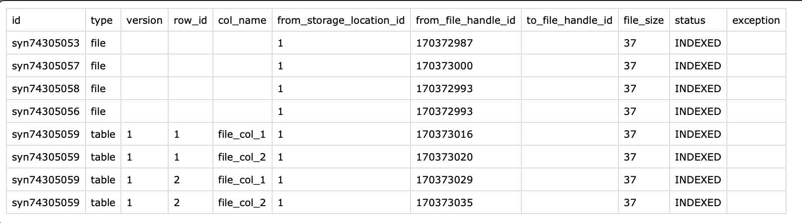
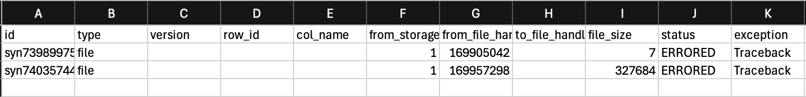

# Migrating Files to a New Storage Location

Storage location migration lets you move files from one Synapse storage location
to another — for example, from Synapse-managed S3 (`SYNAPSE_S3`) to your own
S3 bucket (`EXTERNAL_S3`). The process is intentionally two-phase so you can
review exactly what will be moved before committing to the transfer.

This tutorial demonstrates how to index a folder's files and then migrate them
to a new storage location using the Python client.

[Read more about Custom Storage Locations](https://help.synapse.org/docs/Custom-Storage-Locations.2048327803.html)
[Read more about setting up storage location](./storage_location.md)

## Tutorial Purpose

In this tutorial you will:

1. Set up and get a project and folder
2. Index files in a folder for migration to a destination storage location
3. Review the index results CSV
4. Migrate the indexed files
5. Review the migration results CSV

## Prerequisites

* Make sure that you have completed the [Installation](../installation.md) and
  [Authentication](../authentication.md) setup.
* You must have a [Project](./project.md) and a destination storage location
  already created. See the [Storage Locations tutorial](./storage_location.md).
* Migration is currently supported **only** between S3 storage locations
  (`SYNAPSE_S3` and `EXTERNAL_S3`) that reside in the **same AWS region**.

## How Migration Works

Migration is a two-phase process:

1. **Index** — scan the project or folder and record every file that needs to
   move into a local SQLite database.
2. **Migrate** — read the index database and copy each file to the destination
   storage location, updating the entity's file handle.

Separating the phases lets you inspect what will be migrated before committing
to the move.

> **Warning:** Migration modifies existing entities. Always run against a test
> project first and review the index results before migrating production data.

## 1. Set up and get project

```python
{!docs/tutorials/python/tutorial_scripts/migration.py!lines:"start:setup":"end:setup"}
```

## 2. Index and migrate files

Phase 1 scans the folder and records all files that need to move. The result is
a `MigrationResult` whose `db_path` points to the local SQLite database. Use
`as_csv` to export the index for review before proceeding.

Phase 2 reads the index database and performs the actual migration, returning
another `MigrationResult`. Set `continue_on_error=True` to record failures in
the database rather than aborting. Set `force=True` to skip the interactive
confirmation prompt.

```python
{!docs/tutorials/python/tutorial_scripts/migration.py!lines:"start:index_and_migrate_files":"end:migrate_indexed_files"}
```

Review the index CSV to confirm what was discovered before migration runs:



After migration, inspect the results CSV for status details and any errors.
Detailed tracebacks are saved in the exception column of the CSV:



## Source code for this tutorial

<details class="quote">
  <summary>Click to show me</summary>

```python
{!docs/tutorials/python/tutorial_scripts/migration.py!}
```
</details>

## References used in this tutorial

- [Folder][synapseclient.models.Folder]
- [Project][synapseclient.models.Project]
- [FailureStrategy][synapseclient.models.FailureStrategy]
- [MigrationResult][synapseclient.models.services.MigrationResult]
- [syn.login][synapseclient.Synapse.login]
- [Custom Storage Locations Documentation](https://help.synapse.org/docs/Custom-Storage-Locations.2048327803.html)

## See also

- [Storage Location Tutorial](./storage_location.md) — How to create and manage storage locations
- [Storage Location Architecture](../../explanations/storage_location_architecture.md) — In-depth architecture diagrams and design documentation
