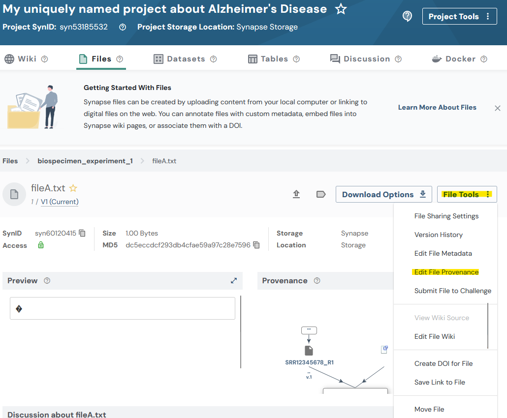
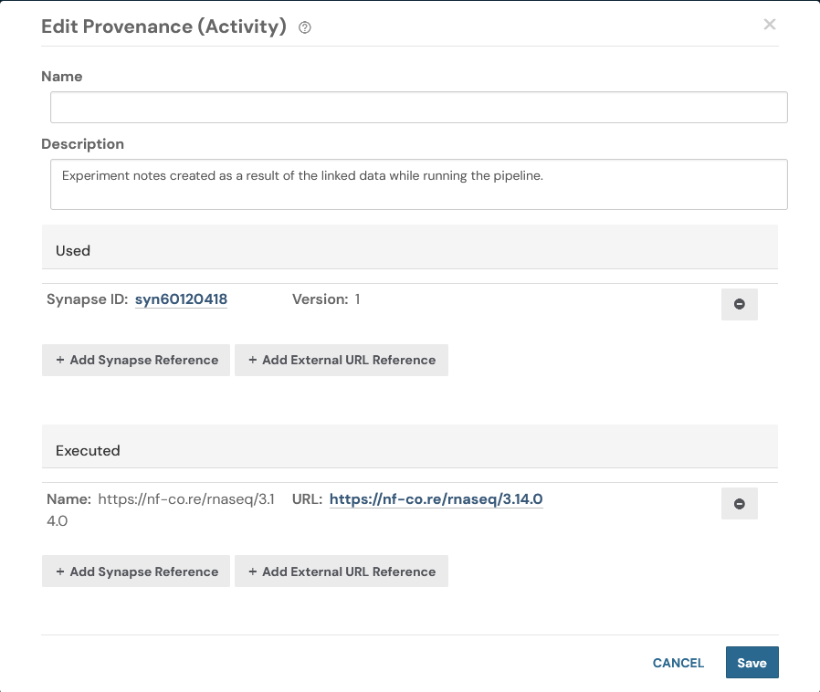

# Uploading data in bulk
This tutorial will follow a
[Flattened Data Layout](../../explanations/structuring_your_project.md#flattened-data-layout-example).
With a project that has this example layout:
```
.
├── biospecimen_experiment_1
│   ├── fileA.txt
│   └── fileB.txt
├── biospecimen_experiment_2
│   ├── fileC.txt
│   └── fileD.txt
├── single_cell_RNAseq_batch_1
│   ├── SRR12345678_R1.fastq.gz
│   └── SRR12345678_R2.fastq.gz
└── single_cell_RNAseq_batch_2
    ├── SRR12345678_R1.fastq.gz
    └── SRR12345678_R2.fastq.gz
```

## Tutorial Purpose
In this tutorial you will:

1. Find the synapse ID of your project
1. Create a manifest TSV file to upload data in bulk
1. Upload all of the files for our project
1. Add an annotation to all of our files
1. Add a provenance/activity record to one of our files

!!! warning "Uploading Very Large Files"
    The bulk upload approach using `synapseutils.syncToSynapse()` is optimized for uploading many files efficiently. However, if you are uploading very large files (>100 GiB each), consider using the **async OOP API with sequential uploads** instead.

    For very large file uploads, see the `execute_walk_file_sequential()` function in [uploadBenchmark.py](https://github.com/Sage-Bionetworks/synapsePythonClient/blob/develop/docs/scripts/uploadBenchmark.py) as a reference implementation. This approach uses `asyncio.run(file.store_async())` with the newer async API, which has been optimized for handling very large files efficiently. In benchmarks, this pattern successfully uploaded 45 files of 100 GB each (4.5 TB total) in approximately 20.6 hours.


## Prerequisites
* Make sure that you have completed the following tutorials:
    * [Project](./project.md)
* This tutorial is setup to upload the data from `~/my_ad_project`, make sure that this or
another desired directory exists.
* Pandas is used in this tutorial. Refer to our
[installation guide](../installation.md#pypi) to install it. Feel free to skip this
portion of the tutorial if you do not wish to use Pandas. You may also use external
tools to open and manipulate Tab Separated Value (TSV) files.


## 1. Find the synapse ID of your project

First let's set up some constants we'll use in this script, and find the ID of our project
```python
{!docs/tutorials/python/tutorial_scripts/upload_data_in_bulk.py!lines=5-20}
```

## 2. Create a manifest TSV file to upload data in bulk

Let's "walk" our directory on disk to create a manifest file for upload
```python
{!docs/tutorials/python/tutorial_scripts/upload_data_in_bulk.py!lines=21-31}
```

<details class="example">
  <summary>After this has been run if you inspect the TSV file created you'll see it will look
similar to this:</summary>
```
path    parent
/home/user_name/my_ad_project/single_cell_RNAseq_batch_2/SRR12345678_R2.fastq.gz  syn60109537
/home/user_name/my_ad_project/single_cell_RNAseq_batch_2/SRR12345678_R1.fastq.gz  syn60109537
/home/user_name/my_ad_project/biospecimen_experiment_2/fileD.txt  syn60109543
/home/user_name/my_ad_project/biospecimen_experiment_2/fileC.txt  syn60109543
/home/user_name/my_ad_project/single_cell_RNAseq_batch_1/SRR12345678_R2.fastq.gz  syn60109534
/home/user_name/my_ad_project/single_cell_RNAseq_batch_1/SRR12345678_R1.fastq.gz  syn60109534
/home/user_name/my_ad_project/biospecimen_experiment_1/fileA.txt  syn60109540
/home/user_name/my_ad_project/biospecimen_experiment_1/fileB.txt  syn60109540
```
</details>

## 3. Upload the data in bulk
```python
{!docs/tutorials/python/tutorial_scripts/upload_data_in_bulk.py!lines=32-36}
```


<details class="example">
  <summary>While this is running you'll see output in your console similar to:</summary>
```
Validation and upload of: /home/user_name/manifest-for-upload.tsv
Validating columns of manifest.....OK
Validating that all paths exist...........OK
Validating that all files are unique...OK
Validating that all the files are not empty...OK
Validating file names...
OK
Validating provenance...OK
Validating that parents exist and are containers...OK
We are about to upload 8 files with a total size of 8.
Uploading 8 files: 100%|███████████████████| 8.00/8.00 [00:01<00:00, 6.09B/s]
```
</details>


## 4. Add an annotation to our manifest file
At this point in the tutorial we will start to use pandas to manipulate a TSV file. If
you are not comfortable with pandas you may use any tool that can open and manipulate
TSV such as excel or google sheets.

```python
{!docs/tutorials/python/tutorial_scripts/upload_data_in_bulk.py!lines=37-57}
```

Now that you have uploaded and annotated your files you'll be able to inspect your data
on the Files tab of your project in the synapse web UI. Each file will have a single
annotation that you added in the previous step. In more advanced workflows you'll likely
need to build a more complex manifest file, but this should give you a good starting
point.


## 5. Create an Activity/Provenance
Let's create an [Activity/Provenance](../../explanations/domain_models_of_synapse.md#activityprovenance)
record for one of our files. In otherwords, we will record the steps taken to generate
the file.

In this code we are finding a row in our TSV file and pointing to the file path of
another file within our manifest. By doing this we are creating a relationship between
the two files. This is a simple example of how you can create a provenance record in
Synapse. Additionally we'll link off to a sample URL that describes a process that we
may have executed to generate the file.

```python
{!docs/tutorials/python/tutorial_scripts/upload_data_in_bulk.py!lines=58-90}
```

After running this code we may again inspect the synapse web UI. In this screenshot i've
navigated to the Files tab and selected the file that we added a Provenance record to.








## Source code for this tutorial

<details class="quote">
  <summary>Click to show me</summary>

```python
{!docs/tutorials/python/tutorial_scripts/upload_data_in_bulk.py!}
```
</details>

## References used in this tutorial

- [syn.login][synapseclient.Synapse.login]
- [syn.findEntityId][synapseclient.Synapse.findEntityId]
- [synapseutils.generate_sync_manifest][]
- [synapseutils.syncToSynapse][]
- [Activity/Provenance](../../explanations/domain_models_of_synapse.md#activityprovenance)
